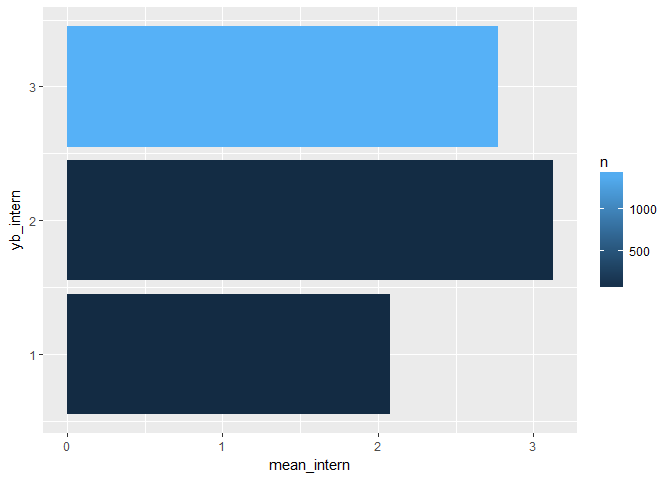
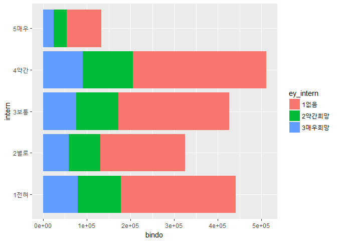
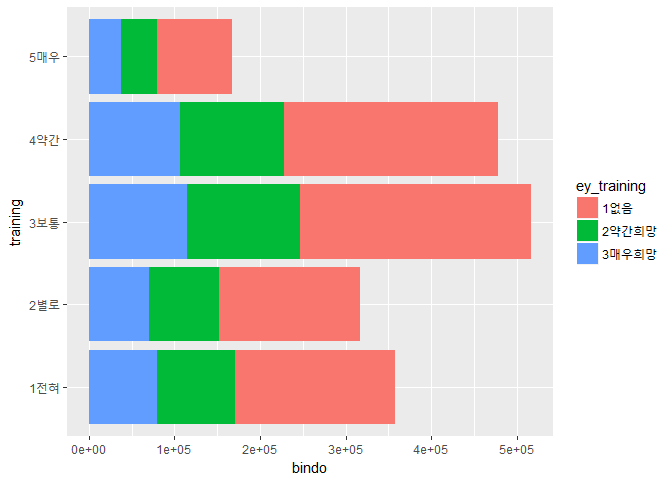
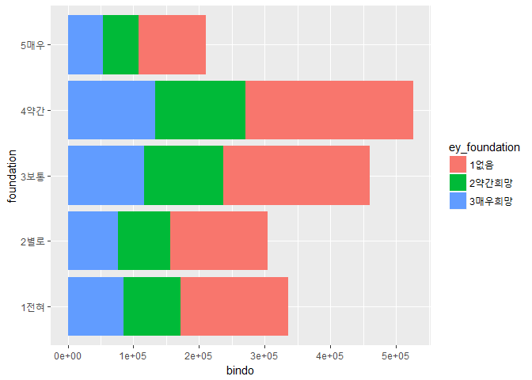

huijeong\_report
================


2018\_1\_refort
================

**1. 요약(초록)**
=================

청년실업률에 정부의 고용지원이 얼마나 청년들에게 도움이 되는지를 분석하였다. 서울복지실태조사 데이터에 있는 청년들의 데이터와 고용지원서비스(정부의 실업률에 관한 대책방안)를 통해서 얼마나 이 서비스가 효과적으로 청년들에게 도움이 되고 있는지를 알아보고자 한다.

**2. 분석 주제**
================

1) 문제의식
-----------

청년 실업률이란, 15세~29세에 해당하는 청년층의 실업을 의미한다. 한국은 매년 통계청이 실업률, 청년실업률에 관한 통계자료를 발표한다. 그 자료를 보면, 경제협력개발기구(OECD) 회원국들의 청년실업률 추이가 감소하는 것에 반해 한국은 2014년에는 9.0, 2015년에는 9.1, 2016년과 2017년에는 9.8로 청년실업률 추이가 증가하고 있다. 이를 통해서 현재 한국의 청년 실업률이 얼마나 심각한지 깨닫을 수 있었다.

2) 알아보고자 하는 것
---------------------

최근 대두되고 있는 청년실업률은 경제상황 악화, 일자리 감소를 비롯한 여러 원인 때문에 일어나고 있다. 이렇게 심각한 청년 실업률에 대한 정부의 대응 방안은 어떤 효과를 불러오는지 궁금해졌다. 고용지원서비스 실제 이용여부와 도움정도의 관계와 도움정도가 미치는 이용의향에 대한 영향에 대해 알아보고자 한다.

**3. 데이터 선정**
==================

1)데이터 선정 이유
------------------

2015 서울복지실태조사 데이터는 서울연구데이터서비스 사이트에 올라온 데이터로 서울특별시, 서울연구원이 주관하여 서울시민의 생활실태와 복지 욕구 변화 추적을 위해 데이터를 구축했다. 서울시 복지 정책 수립 및 집행성과 모니터링을 위한 근거 자료 수집을 조사목적으로 조사한 데이터로 필자가 알아보고자하는 청년실업률에 대한 방안을 찾기 위해서 유용하다. 이 데이터에서 가구주, 가구원, 연령, 고용지원서비스를 통해서 정부가 지원하는 고용지원서비스가 청년들에게 얼마나 도움이 되는지 알아보고자 한다.

2)데이터 소개
-------------

출처: 서울연구데이터서비스 URL: <http://data.si.re.kr/sisurvey2015er17> 특성과 구성은 아래 데이터 파악하기에서 확인할 수 있다.

**4. 분석**
===========

1)분석 목적 및 방법
-------------------

-목적: 고용지원서비스 이용자별 고용지원서비스 도움정도 분석 \#\#\#데이터불러오기

``` r
library(ggplot2)
library(dplyr)
```

    ## 
    ## Attaching package: 'dplyr'

    ## The following objects are masked from 'package:stats':
    ## 
    ##     filter, lag

    ## The following objects are masked from 'package:base':
    ## 
    ##     intersect, setdiff, setequal, union

``` r
library(readxl)
```

    ## Warning: package 'readxl' was built under R version 3.4.4

``` r
raw_welfare <- read_excel("2015_seoul_bockjisiltae_data.xlsx")
```

    ## Warning in read_fun(path = path, sheet_i = sheet, limits = limits, shim =
    ## shim, : Expecting logical in UM1007 / R1007C559: got '媛쒖씤援먯궗'

    ## Warning in read_fun(path = path, sheet_i = sheet, limits = limits, shim =
    ## shim, : Expecting logical in AES2190 / R2190C825: got '�쒓낏�꾩썝�앺솢'

    ## Warning in read_fun(path = path, sheet_i = sheet, limits = limits, shim =
    ## shim, : Expecting logical in PG2194 / R2194C423: got '1�멸�援�'

    ## Warning in read_fun(path = path, sheet_i = sheet, limits = limits, shim =
    ## shim, : Expecting logical in AES2247 / R2247C825: got '�쒓낏�꾩썝�앺솢'

    ## Warning in read_fun(path = path, sheet_i = sheet, limits = limits, shim =
    ## shim, : Expecting logical in AES2257 / R2257C825: got '�쒓낏�꾩썝�앺솢'

``` r
welfare <- raw_welfare
```

먼저 필요한 함수들을 불러오고, 2015서울복지실태조사 데이터 파일이 엑셀파일이므로 readxl함수로 데이터 파일을 불러온다. 원본을 복구해야할 상황을 대비해서 복사본을 만든다.

### 데이터 파악하기(특성, 구성)

``` r
head(welfare)
```

    ## # A tibble: 6 x 828
    ##      ID fff_w~ s_wgt  area resp~ A1_2~ A1_2~ A1_2~ A1_2~ A1_2~ A1_2~ A1_2~
    ##   <dbl>  <dbl> <dbl> <dbl> <dbl> <dbl> <dbl> <dbl> <dbl> <dbl> <dbl> <dbl>
    ## 1  2.00   1473 1.27   3.00  1.00  1.00  2.00  3.00  3.00    NA    NA    NA
    ## 2  3.00   1460 1.26   5.00  2.00  1.00  2.00  3.00 NA       NA    NA    NA
    ## 3  4.00    322 0.277  3.00  2.00  1.00  2.00  3.00 NA       NA    NA    NA
    ## 4  5.00    655 0.564  3.00  1.00  1.00  2.00  3.00  3.00    NA    NA    NA
    ## 5  6.00    588 0.506  3.00  1.00  1.00  3.00 NA    NA       NA    NA    NA
    ## 6  7.00    538 0.464  3.00  2.00  1.00  2.00 NA    NA       NA    NA    NA
    ## # ... with 816 more variables: A1_2_8 <lgl>, A1_2_9 <lgl>, A1_2_10 <lgl>,
    ## #   A1_3_1 <dbl>, A1_3_2 <dbl>, A1_3_3 <dbl>, A1_3_4 <dbl>, A1_3_5 <dbl>,
    ## #   A1_3_6 <dbl>, A1_3_7 <dbl>, A1_3_8 <lgl>, A1_3_9 <lgl>, A1_3_10 <lgl>,
    ## #   A1_4_1_1 <dbl>, A1_4_1_2 <dbl>, A1_4_1_3 <dbl>, A1_4_1_4 <dbl>,
    ## #   A1_4_1_5 <dbl>, A1_4_1_6 <dbl>, A1_4_1_7 <dbl>, A1_4_1_8 <lgl>,
    ## #   A1_4_1_9 <lgl>, A1_4_1_10 <lgl>, A1_4_2_1 <dbl>, A1_4_2_2 <dbl>,
    ## #   A1_4_2_3 <dbl>, A1_4_2_4 <dbl>, A1_4_2_5 <dbl>, A1_4_2_6 <dbl>,
    ## #   A1_4_2_7 <dbl>, A1_4_2_8 <lgl>, A1_4_2_9 <lgl>, A1_4_2_10 <lgl>,
    ## #   age_1 <dbl>, age_2 <dbl>, age_3 <dbl>, age_4 <dbl>, age_5 <dbl>,
    ## #   age_6 <dbl>, age_7 <dbl>, age_8 <lgl>, age_9 <lgl>, age_10 <lgl>,
    ## #   A1_5_1 <dbl>, A1_5_2 <dbl>, A1_5_3 <dbl>, A1_5_4 <dbl>, A1_5_5 <dbl>,
    ## #   A1_5_6 <dbl>, A1_5_7 <dbl>, A1_5_8 <lgl>, A1_5_9 <lgl>, A1_5_10 <lgl>,
    ## #   A1_6_1 <dbl>, A1_7_1 <dbl>, A1_8_1 <dbl>, A1_9_1 <dbl>, A1_6_2 <dbl>,
    ## #   A1_7_2 <dbl>, A1_8_2 <dbl>, A1_9_2 <dbl>, A1_6_3 <dbl>, A1_7_3 <dbl>,
    ## #   A1_8_3 <dbl>, A1_9_3 <dbl>, A1_6_4 <dbl>, A1_7_4 <dbl>, A1_8_4 <dbl>,
    ## #   A1_9_4 <dbl>, A1_6_5 <dbl>, A1_7_5 <dbl>, A1_8_5 <dbl>, A1_9_5 <dbl>,
    ## #   A1_6_6 <dbl>, A1_7_6 <dbl>, A1_8_6 <dbl>, A1_9_6 <dbl>, A1_6_7 <dbl>,
    ## #   A1_7_7 <dbl>, A1_8_7 <dbl>, A1_9_7 <dbl>, A1_6_8 <lgl>, A1_7_8 <lgl>,
    ## #   A1_8_8 <lgl>, A1_9_8 <lgl>, A1_6_9 <lgl>, A1_7_9 <lgl>, A1_8_9 <lgl>,
    ## #   A1_9_9 <lgl>, A1_6_10 <lgl>, A1_7_10 <lgl>, A1_8_10 <lgl>,
    ## #   A1_9_10 <lgl>, A1_10 <dbl>, fam_n <dbl>, fam_t <dbl>, fam_t_t <dbl>,
    ## #   child_n <dbl>, fam_m <dbl>, fam_o <dbl>, ...

``` r
tail(welfare)
```

    ## # A tibble: 6 x 828
    ##      ID fff_w~ s_wgt  area resp~ A1_2~ A1_2~ A1_2~ A1_2~ A1_2~ A1_2~ A1_2~
    ##   <dbl>  <dbl> <dbl> <dbl> <dbl> <dbl> <dbl> <dbl> <dbl> <dbl> <dbl> <dbl>
    ## 1  4127   1032 0.889  2.00  1.00  1.00 NA    NA    NA       NA    NA    NA
    ## 2  4130    877 0.756  3.00  1.00  1.00  2.00  3.00 NA       NA    NA    NA
    ## 3  4131    279 0.241  3.00  1.00  1.00 NA    NA    NA       NA    NA    NA
    ## 4  4133    266 0.229  5.00  2.00  1.00  2.00  3.00  3.00    NA    NA    NA
    ## 5  4134    610 0.526  5.00  1.00  1.00 NA    NA    NA       NA    NA    NA
    ## 6  4136    665 0.573  3.00  1.00  1.00 NA    NA    NA       NA    NA    NA
    ## # ... with 816 more variables: A1_2_8 <lgl>, A1_2_9 <lgl>, A1_2_10 <lgl>,
    ## #   A1_3_1 <dbl>, A1_3_2 <dbl>, A1_3_3 <dbl>, A1_3_4 <dbl>, A1_3_5 <dbl>,
    ## #   A1_3_6 <dbl>, A1_3_7 <dbl>, A1_3_8 <lgl>, A1_3_9 <lgl>, A1_3_10 <lgl>,
    ## #   A1_4_1_1 <dbl>, A1_4_1_2 <dbl>, A1_4_1_3 <dbl>, A1_4_1_4 <dbl>,
    ## #   A1_4_1_5 <dbl>, A1_4_1_6 <dbl>, A1_4_1_7 <dbl>, A1_4_1_8 <lgl>,
    ## #   A1_4_1_9 <lgl>, A1_4_1_10 <lgl>, A1_4_2_1 <dbl>, A1_4_2_2 <dbl>,
    ## #   A1_4_2_3 <dbl>, A1_4_2_4 <dbl>, A1_4_2_5 <dbl>, A1_4_2_6 <dbl>,
    ## #   A1_4_2_7 <dbl>, A1_4_2_8 <lgl>, A1_4_2_9 <lgl>, A1_4_2_10 <lgl>,
    ## #   age_1 <dbl>, age_2 <dbl>, age_3 <dbl>, age_4 <dbl>, age_5 <dbl>,
    ## #   age_6 <dbl>, age_7 <dbl>, age_8 <lgl>, age_9 <lgl>, age_10 <lgl>,
    ## #   A1_5_1 <dbl>, A1_5_2 <dbl>, A1_5_3 <dbl>, A1_5_4 <dbl>, A1_5_5 <dbl>,
    ## #   A1_5_6 <dbl>, A1_5_7 <dbl>, A1_5_8 <lgl>, A1_5_9 <lgl>, A1_5_10 <lgl>,
    ## #   A1_6_1 <dbl>, A1_7_1 <dbl>, A1_8_1 <dbl>, A1_9_1 <dbl>, A1_6_2 <dbl>,
    ## #   A1_7_2 <dbl>, A1_8_2 <dbl>, A1_9_2 <dbl>, A1_6_3 <dbl>, A1_7_3 <dbl>,
    ## #   A1_8_3 <dbl>, A1_9_3 <dbl>, A1_6_4 <dbl>, A1_7_4 <dbl>, A1_8_4 <dbl>,
    ## #   A1_9_4 <dbl>, A1_6_5 <dbl>, A1_7_5 <dbl>, A1_8_5 <dbl>, A1_9_5 <dbl>,
    ## #   A1_6_6 <dbl>, A1_7_6 <dbl>, A1_8_6 <dbl>, A1_9_6 <dbl>, A1_6_7 <dbl>,
    ## #   A1_7_7 <dbl>, A1_8_7 <dbl>, A1_9_7 <dbl>, A1_6_8 <lgl>, A1_7_8 <lgl>,
    ## #   A1_8_8 <lgl>, A1_9_8 <lgl>, A1_6_9 <lgl>, A1_7_9 <lgl>, A1_8_9 <lgl>,
    ## #   A1_9_9 <lgl>, A1_6_10 <lgl>, A1_7_10 <lgl>, A1_8_10 <lgl>,
    ## #   A1_9_10 <lgl>, A1_10 <dbl>, fam_n <dbl>, fam_t <dbl>, fam_t_t <dbl>,
    ## #   child_n <dbl>, fam_m <dbl>, fam_o <dbl>, ...

``` r
dim(welfare)
```

    ## [1] 3019  828

``` r
str(welfare)
```

    ## Classes 'tbl_df', 'tbl' and 'data.frame':    3019 obs. of  828 variables:
    ##  $ ID          : num  2 3 4 5 6 7 8 9 10 11 ...
    ##  $ fff_wgt     : num  1473 1460 322 655 588 ...
    ##  $ s_wgt       : num  1.269 1.258 0.277 0.564 0.506 ...
    ##  $ area        : num  3 5 3 3 3 3 3 3 3 3 ...
    ##  $ respondent  : num  1 2 2 1 1 2 1 1 1 1 ...
    ##  $ A1_2_1      : num  1 1 1 1 1 1 1 1 1 1 ...
    ##  $ A1_2_2      : num  2 2 2 2 3 2 3 3 2 2 ...
    ##  $ A1_2_3      : num  3 3 3 3 NA NA 3 NA 3 3 ...
    ##  $ A1_2_4      : num  3 NA NA 3 NA NA NA NA 3 3 ...
    ##  $ A1_2_5      : num  NA NA NA NA NA NA NA NA NA NA ...
    ##  $ A1_2_6      : num  NA NA NA NA NA NA NA NA NA NA ...
    ##  $ A1_2_7      : num  NA NA NA NA NA NA NA NA NA NA ...
    ##  $ A1_2_8      : logi  NA NA NA NA NA NA ...
    ##  $ A1_2_9      : logi  NA NA NA NA NA NA ...
    ##  $ A1_2_10     : logi  NA NA NA NA NA NA ...
    ##  $ A1_3_1      : num  1 1 1 1 2 1 2 2 1 1 ...
    ##  $ A1_3_2      : num  2 2 2 2 2 2 1 1 2 2 ...
    ##  $ A1_3_3      : num  1 1 1 2 NA NA 2 NA 1 1 ...
    ##  $ A1_3_4      : num  2 NA NA 2 NA NA NA NA 2 2 ...
    ##  $ A1_3_5      : num  NA NA NA NA NA NA NA NA NA NA ...
    ##  $ A1_3_6      : num  NA NA NA NA NA NA NA NA NA NA ...
    ##  $ A1_3_7      : num  NA NA NA NA NA NA NA NA NA NA ...
    ##  $ A1_3_8      : logi  NA NA NA NA NA NA ...
    ##  $ A1_3_9      : logi  NA NA NA NA NA NA ...
    ##  $ A1_3_10     : logi  NA NA NA NA NA NA ...
    ##  $ A1_4_1_1    : num  1954 1950 1964 1962 1966 ...
    ##  $ A1_4_1_2    : num  1958 1955 1996 1962 1995 ...
    ##  $ A1_4_1_3    : num  1984 1989 1992 1985 NA ...
    ##  $ A1_4_1_4    : num  1986 NA NA 1988 NA ...
    ##  $ A1_4_1_5    : num  NA NA NA NA NA NA NA NA NA NA ...
    ##  $ A1_4_1_6    : num  NA NA NA NA NA NA NA NA NA NA ...
    ##  $ A1_4_1_7    : num  NA NA NA NA NA NA NA NA NA NA ...
    ##  $ A1_4_1_8    : logi  NA NA NA NA NA NA ...
    ##  $ A1_4_1_9    : logi  NA NA NA NA NA NA ...
    ##  $ A1_4_1_10   : logi  NA NA NA NA NA NA ...
    ##  $ A1_4_2_1    : num  7 1 7 2 4 8 8 6 12 11 ...
    ##  $ A1_4_2_2    : num  6 9 5 3 8 11 9 3 1 3 ...
    ##  $ A1_4_2_3    : num  9 2 10 7 NA NA 2 NA 5 5 ...
    ##  $ A1_4_2_4    : num  8 NA NA 5 NA NA NA NA 8 2 ...
    ##  $ A1_4_2_5    : num  NA NA NA NA NA NA NA NA NA NA ...
    ##  $ A1_4_2_6    : num  NA NA NA NA NA NA NA NA NA NA ...
    ##  $ A1_4_2_7    : num  NA NA NA NA NA NA NA NA NA NA ...
    ##  $ A1_4_2_8    : logi  NA NA NA NA NA NA ...
    ##  $ A1_4_2_9    : logi  NA NA NA NA NA NA ...
    ##  $ A1_4_2_10   : logi  NA NA NA NA NA NA ...
    ##  $ age_1       : num  61 65 51 53 49 77 58 49 50 50 ...
    ##  $ age_2       : num  57 60 19 53 20 71 28 19 49 48 ...
    ##  $ age_3       : num  31 26 23 30 NA NA 25 NA 22 21 ...
    ##  $ age_4       : num  29 NA NA 27 NA NA NA NA 20 22 ...
    ##  $ age_5       : num  NA NA NA NA NA NA NA NA NA NA ...
    ##  $ age_6       : num  NA NA NA NA NA NA NA NA NA NA ...
    ##  $ age_7       : num  NA NA NA NA NA NA NA NA NA NA ...
    ##  $ age_8       : logi  NA NA NA NA NA NA ...
    ##  $ age_9       : logi  NA NA NA NA NA NA ...
    ##  $ age_10      : logi  NA NA NA NA NA NA ...
    ##  $ A1_5_1      : num  1 1 1 1 1 1 1 1 1 1 ...
    ##  $ A1_5_2      : num  1 1 1 1 1 1 1 1 1 1 ...
    ##  $ A1_5_3      : num  1 1 1 1 NA NA 1 NA 1 1 ...
    ##  $ A1_5_4      : num  1 NA NA 1 NA NA NA NA 1 1 ...
    ##  $ A1_5_5      : num  NA NA NA NA NA NA NA NA NA NA ...
    ##  $ A1_5_6      : num  NA NA NA NA NA NA NA NA NA NA ...
    ##  $ A1_5_7      : num  NA NA NA NA NA NA NA NA NA NA ...
    ##  $ A1_5_8      : logi  NA NA NA NA NA NA ...
    ##  $ A1_5_9      : logi  NA NA NA NA NA NA ...
    ##  $ A1_5_10     : logi  NA NA NA NA NA NA ...
    ##  $ A1_6_1      : num  5 5 6 5 5 3 5 5 5 5 ...
    ##  $ A1_7_1      : num  5 5 5 5 5 5 5 5 5 5 ...
    ##  $ A1_8_1      : num  1 1 1 1 3 1 2 3 1 1 ...
    ##  $ A1_9_1      : num  1 1 1 1 1 1 1 1 1 1 ...
    ##  $ A1_6_2      : num  5 5 7 5 5 3 7 5 5 5 ...
    ##  $ A1_7_2      : num  5 5 5 5 5 5 5 5 5 5 ...
    ##  $ A1_8_2      : num  1 1 1 1 5 1 5 5 1 1 ...
    ##  $ A1_9_2      : num  1 1 1 1 1 1 1 1 1 1 ...
    ##  $ A1_6_3      : num  5 5 7 6 NA NA 7 NA 7 5 ...
    ##  $ A1_7_3      : num  5 5 1 5 NA NA 5 NA 1 5 ...
    ##  $ A1_8_3      : num  5 5 5 5 NA NA 5 NA 5 5 ...
    ##  $ A1_9_3      : num  1 1 1 1 NA NA 1 NA 1 1 ...
    ##  $ A1_6_4      : num  6 NA NA 6 NA NA NA NA 7 7 ...
    ##  $ A1_7_4      : num  5 NA NA 5 NA NA NA NA 1 1 ...
    ##  $ A1_8_4      : num  5 NA NA 5 NA NA NA NA 5 5 ...
    ##  $ A1_9_4      : num  1 NA NA 1 NA NA NA NA 1 1 ...
    ##  $ A1_6_5      : num  NA NA NA NA NA NA NA NA NA NA ...
    ##  $ A1_7_5      : num  NA NA NA NA NA NA NA NA NA NA ...
    ##  $ A1_8_5      : num  NA NA NA NA NA NA NA NA NA NA ...
    ##  $ A1_9_5      : num  NA NA NA NA NA NA NA NA NA NA ...
    ##  $ A1_6_6      : num  NA NA NA NA NA NA NA NA NA NA ...
    ##  $ A1_7_6      : num  NA NA NA NA NA NA NA NA NA NA ...
    ##  $ A1_8_6      : num  NA NA NA NA NA NA NA NA NA NA ...
    ##  $ A1_9_6      : num  NA NA NA NA NA NA NA NA NA NA ...
    ##  $ A1_6_7      : num  NA NA NA NA NA NA NA NA NA NA ...
    ##  $ A1_7_7      : num  NA NA NA NA NA NA NA NA NA NA ...
    ##  $ A1_8_7      : num  NA NA NA NA NA NA NA NA NA NA ...
    ##  $ A1_9_7      : num  NA NA NA NA NA NA NA NA NA NA ...
    ##  $ A1_6_8      : logi  NA NA NA NA NA NA ...
    ##  $ A1_7_8      : logi  NA NA NA NA NA NA ...
    ##  $ A1_8_8      : logi  NA NA NA NA NA NA ...
    ##  $ A1_9_8      : logi  NA NA NA NA NA NA ...
    ##  $ A1_6_9      : logi  NA NA NA NA NA NA ...
    ##  $ A1_7_9      : logi  NA NA NA NA NA NA ...
    ##   [list output truncated]

``` r
summary(welfare)
```

    ##        ID            fff_wgt           s_wgt             area     
    ##  Min.   :   2.0   Min.   : 122.1   Min.   :0.1052   Min.   :1.00  
    ##  1st Qu.: 804.5   1st Qu.: 515.0   1st Qu.:0.4437   1st Qu.:2.00  
    ##  Median :2562.0   Median : 875.7   Median :0.7544   Median :3.00  
    ##  Mean   :2313.8   Mean   :1160.7   Mean   :1.0000   Mean   :3.16  
    ##  3rd Qu.:3337.5   3rd Qu.:1440.3   3rd Qu.:1.2408   3rd Qu.:4.00  
    ##  Max.   :4136.0   Max.   :5703.8   Max.   :4.9139   Max.   :5.00  
    ##                                                                   
    ##    respondent        A1_2_1      A1_2_2           A1_2_3      
    ##  Min.   :1.000   Min.   :1   Min.   : 2.000   Min.   : 2.000  
    ##  1st Qu.:1.000   1st Qu.:1   1st Qu.: 2.000   1st Qu.: 3.000  
    ##  Median :1.000   Median :1   Median : 2.000   Median : 3.000  
    ##  Mean   :1.495   Mean   :1   Mean   : 2.333   Mean   : 3.122  
    ##  3rd Qu.:2.000   3rd Qu.:1   3rd Qu.: 2.000   3rd Qu.: 3.000  
    ##  Max.   :6.000   Max.   :1   Max.   :15.000   Max.   :15.000  
    ##                              NA's   :797      NA's   :1641    
    ##      A1_2_4          A1_2_5           A1_2_6           A1_2_7      
    ##  Min.   :2.000   Min.   : 3.000   Min.   : 3.000   Min.   : 3.000  
    ##  1st Qu.:3.000   1st Qu.: 3.000   1st Qu.: 3.000   1st Qu.: 3.000  
    ##  Median :3.000   Median : 3.000   Median : 3.000   Median : 3.000  
    ##  Mean   :3.105   Mean   : 3.989   Mean   : 5.053   Mean   : 5.429  
    ##  3rd Qu.:3.000   3rd Qu.: 5.000   3rd Qu.: 6.500   3rd Qu.: 7.000  
    ##  Max.   :9.000   Max.   :15.000   Max.   :15.000   Max.   :12.000  
    ##  NA's   :2305    NA's   :2929     NA's   :3000     NA's   :3012    
    ##   A1_2_8         A1_2_9        A1_2_10            A1_3_1     
    ##  Mode:logical   Mode:logical   Mode:logical   Min.   :1.000  
    ##  TRUE:2         TRUE:1         NA's:3019      1st Qu.:1.000  
    ##  NA's:3017      NA's:3018                     Median :1.000  
    ##                                               Mean   :1.275  
    ##                                               3rd Qu.:2.000  
    ##                                               Max.   :2.000  
    ##                                                              
    ##      A1_3_2          A1_3_3         A1_3_4          A1_3_5     
    ##  Min.   :1.000   Min.   :1.00   Min.   :1.000   Min.   :1.000  
    ##  1st Qu.:2.000   1st Qu.:1.00   1st Qu.:1.000   1st Qu.:1.000  
    ##  Median :2.000   Median :1.00   Median :2.000   Median :1.000  
    ##  Mean   :1.907   Mean   :1.49   Mean   :1.543   Mean   :1.433  
    ##  3rd Qu.:2.000   3rd Qu.:2.00   3rd Qu.:2.000   3rd Qu.:2.000  
    ##  Max.   :2.000   Max.   :2.00   Max.   :2.000   Max.   :2.000  
    ##  NA's   :797     NA's   :1641   NA's   :2305    NA's   :2929   
    ##      A1_3_6          A1_3_7       A1_3_8         A1_3_9       
    ##  Min.   :1.000   Min.   :1.000   Mode:logical   Mode:logical  
    ##  1st Qu.:1.000   1st Qu.:1.000   TRUE:2         TRUE:1        
    ##  Median :1.000   Median :1.000   NA's:3017      NA's:3018     
    ##  Mean   :1.474   Mean   :1.286                                
    ##  3rd Qu.:2.000   3rd Qu.:1.500                                
    ##  Max.   :2.000   Max.   :2.000                                
    ##  NA's   :3000    NA's   :3012                                 
    ##  A1_3_10           A1_4_1_1       A1_4_1_2       A1_4_1_3   
    ##  Mode:logical   Min.   :1920   Min.   :1923   Min.   :1922  
    ##  NA's:3019      1st Qu.:1954   1st Qu.:1958   1st Qu.:1989  
    ##                 Median :1962   Median :1967   Median :1994  
    ##                 Mean   :1963   Mean   :1968   Mean   :1995  
    ##                 3rd Qu.:1972   3rd Qu.:1979   3rd Qu.:2001  
    ##                 Max.   :1997   Max.   :2014   Max.   :2015  
    ##                                NA's   :797    NA's   :1641  
    ##     A1_4_1_4       A1_4_1_5       A1_4_1_6       A1_4_1_7   
    ##  Min.   :1929   Min.   :1934   Min.   :1938   Min.   :1977  
    ##  1st Qu.:1993   1st Qu.:1989   1st Qu.:1984   1st Qu.:2009  
    ##  Median :1997   Median :2000   Median :1996   Median :2010  
    ##  Mean   :1997   Mean   :1992   Mean   :1990   Mean   :2006  
    ##  3rd Qu.:2003   3rd Qu.:2007   3rd Qu.:2008   3rd Qu.:2011  
    ##  Max.   :2015   Max.   :2014   Max.   :2012   Max.   :2015  
    ##  NA's   :2305   NA's   :2929   NA's   :3000   NA's   :3012  
    ##  A1_4_1_8       A1_4_1_9       A1_4_1_10         A1_4_2_1     
    ##  Mode:logical   Mode:logical   Mode:logical   Min.   : 1.000  
    ##  TRUE:2         TRUE:1         NA's:3019      1st Qu.: 3.000  
    ##  NA's:3017      NA's:3018                     Median : 5.000  
    ##                                               Mean   : 6.027  
    ##                                               3rd Qu.: 9.000  
    ##                                               Max.   :12.000  
    ##                                                               
    ##     A1_4_2_2         A1_4_2_3         A1_4_2_4         A1_4_2_5   
    ##  Min.   : 1.000   Min.   : 1.000   Min.   : 1.000   Min.   : 1.0  
    ##  1st Qu.: 4.000   1st Qu.: 4.000   1st Qu.: 4.000   1st Qu.: 3.0  
    ##  Median : 7.000   Median : 6.000   Median : 6.000   Median : 5.0  
    ##  Mean   : 6.822   Mean   : 6.429   Mean   : 6.539   Mean   : 5.9  
    ##  3rd Qu.:10.000   3rd Qu.: 9.000   3rd Qu.: 9.000   3rd Qu.: 8.0  
    ##  Max.   :12.000   Max.   :12.000   Max.   :12.000   Max.   :12.0  
    ##  NA's   :797      NA's   :1641     NA's   :2305     NA's   :2929  
    ##     A1_4_2_6         A1_4_2_7      A1_4_2_8       A1_4_2_9      
    ##  Min.   : 2.000   Min.   : 6.000   Mode:logical   Mode:logical  
    ##  1st Qu.: 4.000   1st Qu.: 7.000   TRUE:2         TRUE:1        
    ##  Median : 4.000   Median : 8.000   NA's:3017      NA's:3018     
    ##  Mean   : 5.474   Mean   : 8.857                                
    ##  3rd Qu.: 7.500   3rd Qu.:11.000                                
    ##  Max.   :12.000   Max.   :12.000                                
    ##  NA's   :3000     NA's   :3012                                  
    ##  A1_4_2_10          age_1           age_2           age_3      
    ##  Mode:logical   Min.   :18.00   Min.   : 1.00   Min.   : 0.00  
    ##  NA's:3019      1st Qu.:43.00   1st Qu.:36.00   1st Qu.:14.00  
    ##                 Median :53.00   Median :48.00   Median :21.00  
    ##                 Mean   :51.97   Mean   :46.98   Mean   :20.44  
    ##                 3rd Qu.:61.00   3rd Qu.:57.00   3rd Qu.:26.00  
    ##                 Max.   :95.00   Max.   :92.00   Max.   :93.00  
    ##                                 NA's   :797     NA's   :1641   
    ##      age_4           age_5           age_6           age_7     
    ##  Min.   : 0.00   Min.   : 1.00   Min.   : 3.00   Min.   : 0    
    ##  1st Qu.:12.00   1st Qu.: 8.00   1st Qu.: 7.00   1st Qu.: 4    
    ##  Median :18.00   Median :15.00   Median :19.00   Median : 5    
    ##  Mean   :17.89   Mean   :22.52   Mean   :24.68   Mean   : 9    
    ##  3rd Qu.:22.00   3rd Qu.:25.75   3rd Qu.:30.50   3rd Qu.: 6    
    ##  Max.   :86.00   Max.   :81.00   Max.   :77.00   Max.   :38    
    ##  NA's   :2305    NA's   :2929    NA's   :3000    NA's   :3012  
    ##   age_8          age_9          age_10            A1_5_1      
    ##  Mode:logical   Mode:logical   Mode:logical   Min.   : 1.000  
    ##  TRUE:2         TRUE:1         NA's:3019      1st Qu.: 1.000  
    ##  NA's:3017      NA's:3018                     Median : 1.000  
    ##                                               Mean   : 1.098  
    ##                                               3rd Qu.: 1.000  
    ##                                               Max.   :10.000  
    ##                                                               
    ##      A1_5_2           A1_5_3          A1_5_4          A1_5_5     
    ##  Min.   : 1.000   Min.   :1.000   Min.   : 1.00   Min.   :1.000  
    ##  1st Qu.: 1.000   1st Qu.:1.000   1st Qu.: 1.00   1st Qu.:1.000  
    ##  Median : 1.000   Median :1.000   Median : 1.00   Median :1.000  
    ##  Mean   : 1.018   Mean   :1.209   Mean   : 1.27   Mean   :1.078  
    ##  3rd Qu.: 1.000   3rd Qu.:1.000   3rd Qu.: 1.00   3rd Qu.:1.000  
    ##  Max.   :10.000   Max.   :9.000   Max.   :10.00   Max.   :5.000  
    ##  NA's   :797      NA's   :1641    NA's   :2305    NA's   :2929   
    ##      A1_5_6         A1_5_7      A1_5_8         A1_5_9       
    ##  Min.   :1.00   Min.   :1      Mode:logical   Mode:logical  
    ##  1st Qu.:1.00   1st Qu.:1      TRUE:2         TRUE:1        
    ##  Median :1.00   Median :1      NA's:3017      NA's:3018     
    ##  Mean   :1.21   Mean   :1                                   
    ##  3rd Qu.:1.00   3rd Qu.:1                                   
    ##  Max.   :5.00   Max.   :1                                   
    ##  NA's   :3000   NA's   :3012                                
    ##  A1_5_10            A1_6_1          A1_7_1          A1_8_1     
    ##  Mode:logical   Min.   :2.000   Min.   :0.000   Min.   :1.000  
    ##  NA's:3019      1st Qu.:5.000   1st Qu.:5.000   1st Qu.:1.000  
    ##                 Median :5.000   Median :5.000   Median :1.000  
    ##                 Mean   :5.626   Mean   :4.842   Mean   :1.835  
    ##                 3rd Qu.:7.000   3rd Qu.:5.000   3rd Qu.:2.000  
    ##                 Max.   :9.000   Max.   :5.000   Max.   :5.000  
    ##                                                                
    ##      A1_9_1          A1_6_2          A1_7_2          A1_8_2     
    ##  Min.   :1.000   Min.   :1.000   Min.   :0.000   Min.   :0.000  
    ##  1st Qu.:1.000   1st Qu.:5.000   1st Qu.:5.000   1st Qu.:1.000  
    ##  Median :1.000   Median :5.000   Median :5.000   Median :1.000  
    ##  Mean   :1.003   Mean   :5.536   Mean   :4.769   Mean   :1.472  
    ##  3rd Qu.:1.000   3rd Qu.:7.000   3rd Qu.:5.000   3rd Qu.:1.000  
    ##  Max.   :3.000   Max.   :9.000   Max.   :5.000   Max.   :5.000  
    ##                  NA's   :797     NA's   :797     NA's   :797    
    ##      A1_9_2          A1_6_3          A1_7_3          A1_8_3     
    ##  Min.   :1.000   Min.   :1.000   Min.   :0.000   Min.   :0.000  
    ##  1st Qu.:1.000   1st Qu.:4.000   1st Qu.:1.000   1st Qu.:0.000  
    ##  Median :1.000   Median :5.000   Median :1.000   Median :5.000  
    ##  Mean   :1.002   Mean   :5.043   Mean   :2.356   Mean   :2.914  
    ##  3rd Qu.:1.000   3rd Qu.:7.000   3rd Qu.:5.000   3rd Qu.:5.000  
    ##  Max.   :3.000   Max.   :9.000   Max.   :5.000   Max.   :5.000  
    ##  NA's   :797     NA's   :1641    NA's   :1641    NA's   :1641   
    ##      A1_9_3         A1_6_4         A1_7_4          A1_8_4     
    ##  Min.   :1      Min.   :1.0    Min.   :0.000   Min.   :0.000  
    ##  1st Qu.:1      1st Qu.:3.0    1st Qu.:1.000   1st Qu.:0.000  
    ##  Median :1      Median :5.0    Median :1.000   Median :1.000  
    ##  Mean   :1      Mean   :4.7    Mean   :1.695   Mean   :2.384  
    ##  3rd Qu.:1      3rd Qu.:7.0    3rd Qu.:1.000   3rd Qu.:5.000  
    ##  Max.   :1      Max.   :8.0    Max.   :5.000   Max.   :5.000  
    ##  NA's   :1641   NA's   :2305   NA's   :2305    NA's   :2305   
    ##      A1_9_4         A1_6_5          A1_7_5          A1_8_5     
    ##  Min.   :1      Min.   :1.000   Min.   :0.000   Min.   :0.000  
    ##  1st Qu.:1      1st Qu.:3.000   1st Qu.:1.000   1st Qu.:0.000  
    ##  Median :1      Median :4.000   Median :1.000   Median :0.000  
    ##  Mean   :1      Mean   :3.911   Mean   :1.956   Mean   :1.444  
    ##  3rd Qu.:1      3rd Qu.:5.000   3rd Qu.:5.000   3rd Qu.:2.000  
    ##  Max.   :1      Max.   :7.000   Max.   :5.000   Max.   :5.000  
    ##  NA's   :2305   NA's   :2929    NA's   :2929    NA's   :2929   
    ##      A1_9_5          A1_6_6          A1_7_6          A1_8_6     
    ##  Min.   :1.000   Min.   :1.000   Min.   :0.000   Min.   :0.000  
    ##  1st Qu.:1.000   1st Qu.:3.000   1st Qu.:1.000   1st Qu.:0.000  
    ##  Median :1.000   Median :4.000   Median :1.000   Median :1.000  
    ##  Mean   :1.022   Mean   :3.947   Mean   :2.316   Mean   :2.105  
    ##  3rd Qu.:1.000   3rd Qu.:5.000   3rd Qu.:5.000   3rd Qu.:5.000  
    ##  Max.   :3.000   Max.   :7.000   Max.   :5.000   Max.   :5.000  
    ##  NA's   :2929    NA's   :3000    NA's   :3000    NA's   :3000   
    ##      A1_9_6          A1_6_7          A1_7_7           A1_8_7      
    ##  Min.   :1.000   Min.   :1.000   Min.   :0.0000   Min.   :0.0000  
    ##  1st Qu.:1.000   1st Qu.:1.000   1st Qu.:0.0000   1st Qu.:0.0000  
    ##  Median :1.000   Median :1.000   Median :0.0000   Median :0.0000  
    ##  Mean   :1.105   Mean   :1.857   Mean   :0.8571   Mean   :0.7143  
    ##  3rd Qu.:1.000   3rd Qu.:2.000   3rd Qu.:0.5000   3rd Qu.:0.0000  
    ##  Max.   :3.000   Max.   :5.000   Max.   :5.0000   Max.   :5.0000  
    ##  NA's   :3000    NA's   :3012    NA's   :3012     NA's   :3012    
    ##      A1_9_7      A1_6_8          A1_7_8          A1_8_8       
    ##  Min.   :1      Mode:logical   Mode :logical   Mode :logical  
    ##  1st Qu.:1      TRUE:2         FALSE:2         FALSE:2        
    ##  Median :1      NA's:3017      NA's :3017      NA's :3017     
    ##  Mean   :1                                                    
    ##  3rd Qu.:1                                                    
    ##  Max.   :1                                                    
    ##  NA's   :3012                                                 
    ##   A1_9_8         A1_6_9          A1_7_9          A1_8_9       
    ##  Mode:logical   Mode:logical   Mode :logical   Mode :logical  
    ##  TRUE:2         TRUE:1         FALSE:1         FALSE:1        
    ##  NA's:3017      NA's:3018      NA's :3018      NA's :3018     
    ##                                                               
    ##                                                               
    ##                                                               
    ##                                                               
    ##   A1_9_9        A1_6_10        A1_7_10        A1_8_10       
    ##  Mode:logical   Mode:logical   Mode:logical   Mode:logical  
    ##  TRUE:1         NA's:3019      NA's:3019      NA's:3019     
    ##  NA's:3018                                                  
    ##                                                             
    ##                                                             
    ##                                                             
    ##                                                             
    ##  A1_9_10            A1_10           fam_n           fam_t      
    ##  Mode:logical   Min.   :1.000   Min.   :1.000   Min.   :1.000  
    ##  NA's:3019      1st Qu.:1.000   1st Qu.:1.000   1st Qu.:1.000  
    ##                 Median :6.000   Median :2.000   Median :2.000  
    ##                 Mean   :4.622   Mean   :2.468   Mean   :1.548  
    ##                 3rd Qu.:6.000   3rd Qu.:3.000   3rd Qu.:2.000  
    ##                 Max.   :6.000   Max.   :9.000   Max.   :4.000  
    ##                                                                
    ##     fam_t_t          child_n          fam_m           fam_o      
    ##  Min.   : 1.000   Min.   :0.000   Min.   :1.000   Min.   :1.000  
    ##  1st Qu.: 1.000   1st Qu.:0.000   1st Qu.:2.000   1st Qu.:2.000  
    ##  Median : 5.000   Median :1.000   Median :2.000   Median :2.000  
    ##  Mean   : 3.664   Mean   :0.782   Mean   :1.998   Mean   :1.805  
    ##  3rd Qu.: 5.000   3rd Qu.:2.000   3rd Qu.:2.000   3rd Qu.:2.000  
    ##  Max.   :35.000   Max.   :7.000   Max.   :2.000   Max.   :2.000  
    ##                                                                  
    ##      fam_y          fam_h           edu_1           edu_2      
    ##  Min.   :1.00   Min.   :1.000   Min.   :2.000   Min.   :1.000  
    ##  1st Qu.:2.00   1st Qu.:2.000   1st Qu.:4.000   1st Qu.:4.000  
    ##  Median :2.00   Median :2.000   Median :4.000   Median :4.000  
    ##  Mean   :1.93   Mean   :1.972   Mean   :4.297   Mean   :4.261  
    ##  3rd Qu.:2.00   3rd Qu.:2.000   3rd Qu.:5.000   3rd Qu.:5.000  
    ##  Max.   :2.00   Max.   :2.000   Max.   :6.000   Max.   :6.000  
    ##                                                 NA's   :797    
    ##      edu_3           edu_4           edu_5           edu_6     
    ##  Min.   :1.000   Min.   :1.000   Min.   :1.000   Min.   :1     
    ##  1st Qu.:3.000   1st Qu.:2.000   1st Qu.:2.000   1st Qu.:2     
    ##  Median :4.000   Median :4.000   Median :3.000   Median :3     
    ##  Mean   :3.807   Mean   :3.538   Mean   :2.989   Mean   :3     
    ##  3rd Qu.:5.000   3rd Qu.:5.000   3rd Qu.:4.000   3rd Qu.:4     
    ##  Max.   :6.000   Max.   :6.000   Max.   :5.000   Max.   :5     
    ##  NA's   :1641    NA's   :2305    NA's   :2929    NA's   :3000  
    ##      edu_7        edu_8          edu_9          edu_10       
    ##  Min.   :1.000   Mode:logical   Mode:logical   Mode:logical  
    ##  1st Qu.:1.000   TRUE:2         TRUE:1         NA's:3019     
    ##  Median :1.000   NA's:3017      NA's:3018                    
    ##  Mean   :1.571                                               
    ##  3rd Qu.:1.500                                               
    ##  Max.   :4.000                                               
    ##  NA's   :3012                                                
    ##      edu_a1          edu_a2          edu_a3          edu_a4     
    ##  Min.   : 2.00   Min.   : 1.00   Min.   : 1.00   Min.   : 1.00  
    ##  1st Qu.:14.00   1st Qu.:14.00   1st Qu.: 7.00   1st Qu.: 3.00  
    ##  Median :14.00   Median :14.00   Median :14.00   Median :11.00  
    ##  Mean   :17.24   Mean   :16.72   Mean   :13.71   Mean   :11.65  
    ##  3rd Qu.:24.00   3rd Qu.:24.00   3rd Qu.:20.00   3rd Qu.:20.00  
    ##  Max.   :34.00   Max.   :34.00   Max.   :34.00   Max.   :29.00  
    ##                  NA's   :797     NA's   :1641    NA's   :2305   
    ##      edu_a5           edu_a6           edu_a7        edu_a8       
    ##  Min.   : 1.000   Min.   : 1.000   Min.   : 1.000   Mode:logical  
    ##  1st Qu.: 3.000   1st Qu.: 3.000   1st Qu.: 1.000   TRUE:2        
    ##  Median : 7.000   Median :10.000   Median : 1.000   NA's:3017     
    ##  Mean   : 8.944   Mean   : 9.421   Mean   : 3.143                 
    ##  3rd Qu.:14.000   3rd Qu.:14.000   3rd Qu.: 2.000                 
    ##  Max.   :24.000   Max.   :24.000   Max.   :14.000                 
    ##  NA's   :2929     NA's   :3000     NA's   :3012                   
    ##   edu_a9        edu_a10             A2_1           A2_R1     
    ##  Mode:logical   Mode:logical   Min.   :1.000   Min.   :2014  
    ##  TRUE:1         NA's:3019      1st Qu.:1.000   1st Qu.:2014  
    ##  NA's:3018                     Median :1.000   Median :2015  
    ##                                Mean   :1.007   Mean   :2015  
    ##                                3rd Qu.:1.000   3rd Qu.:2015  
    ##                                Max.   :2.000   Max.   :2015  
    ##                                                NA's   :2999  
    ##      A2_R2             A3             A4_1           A4_2_1      
    ##  Min.   : 1.00   Min.   :1.000   Min.   :1.000   Min.   :  1121  
    ##  1st Qu.: 2.00   1st Qu.:2.000   1st Qu.:1.000   1st Qu.: 26000  
    ##  Median : 5.00   Median :4.000   Median :2.000   Median : 35000  
    ##  Mean   : 5.30   Mean   :3.705   Mean   :1.726   Mean   : 49407  
    ##  3rd Qu.: 8.25   3rd Qu.:5.000   3rd Qu.:2.000   3rd Qu.: 48000  
    ##  Max.   :12.00   Max.   :9.000   Max.   :6.000   Max.   :999999  
    ##  NA's   :2999                                    NA's   :1619    
    ##      A4_2_2           A4_2_3           A4_2_4           A4_2_5     
    ##  Min.   :  1500   Min.   :    50   Min.   :     3   Min.   : 5.00  
    ##  1st Qu.:  8500   1st Qu.:  1000   1st Qu.:    20   1st Qu.:15.75  
    ##  Median : 15000   Median :  2000   Median :    30   Median :34.00  
    ##  Mean   : 20882   Mean   : 10064   Mean   :  6929   Mean   :29.54  
    ##  3rd Qu.: 24000   3rd Qu.:  4000   3rd Qu.:    40   3rd Qu.:45.75  
    ##  Max.   :999999   Max.   :999999   Max.   :999999   Max.   :50.00  
    ##  NA's   :1890     NA's   :2584     NA's   :2584     NA's   :2991   
    ##       A5_1             A5_2              A6             A7_1      
    ##  Min.   :  3.00   Min.   : 1.000   Min.   :1.000   Min.   :1.000  
    ##  1st Qu.: 49.50   1st Qu.: 2.000   1st Qu.:3.000   1st Qu.:4.000  
    ##  Median : 75.90   Median : 3.000   Median :3.000   Median :4.000  
    ##  Mean   : 75.91   Mean   : 2.587   Mean   :2.944   Mean   :3.706  
    ##  3rd Qu.: 99.00   3rd Qu.: 3.000   3rd Qu.:3.000   3rd Qu.:4.000  
    ##  Max.   :396.00   Max.   :10.000   Max.   :4.000   Max.   :7.000  
    ##                                                                   
    ##       A7_2             A8              A9             A10       
    ##  Min.   :1.000   Min.   : 1.00   Min.   :1.000   Min.   :1.000  
    ##  1st Qu.:3.000   1st Qu.:10.00   1st Qu.:3.000   1st Qu.:2.000  
    ##  Median :3.000   Median :15.00   Median :4.000   Median :2.000  
    ##  Mean   :3.086   Mean   :15.44   Mean   :3.802   Mean   :1.926  
    ##  3rd Qu.:3.000   3rd Qu.:20.00   3rd Qu.:4.000   3rd Qu.:2.000  
    ##  Max.   :7.000   Max.   :50.00   Max.   :5.000   Max.   :2.000  
    ##  NA's   :972                                                    
    ##      B1_1_1         B1_2_1          B1_3_1          B1_4_1     
    ##  Min.   :1.00   Min.   :1.000   Min.   :1.000   Min.   :1.000  
    ##  1st Qu.:1.00   1st Qu.:2.000   1st Qu.:1.000   1st Qu.:3.000  
    ##  Median :1.00   Median :3.000   Median :1.000   Median :4.000  
    ##  Mean   :1.21   Mean   :2.655   Mean   :3.191   Mean   :4.187  
    ##  3rd Qu.:1.00   3rd Qu.:3.000   3rd Qu.:6.000   3rd Qu.:5.000  
    ##  Max.   :4.00   Max.   :4.000   Max.   :9.000   Max.   :9.000  
    ##                 NA's   :2906                    NA's   :430    
    ##      B1_5_1          B1_6_1           B1_7_1           B1_1_2     
    ##  Min.   :1.000   Min.   :  6.00   Min.   : 1.000   Min.   :0.000  
    ##  1st Qu.:1.000   1st Qu.: 40.00   1st Qu.: 1.000   1st Qu.:1.000  
    ##  Median :1.000   Median : 48.00   Median : 5.000   Median :1.000  
    ##  Mean   :1.052   Mean   : 47.21   Mean   : 5.657   Mean   :1.229  
    ##  3rd Qu.:1.000   3rd Qu.: 54.00   3rd Qu.:10.000   3rd Qu.:1.000  
    ##  Max.   :2.000   Max.   :102.00   Max.   :11.000   Max.   :4.000  
    ##  NA's   :430     NA's   :430      NA's   :2608     NA's   :797    
    ##      B1_2_2          B1_3_2          B1_4_2          B1_5_2     
    ##  Min.   :1.000   Min.   :1.000   Min.   :1.000   Min.   :1.000  
    ##  1st Qu.:3.000   1st Qu.:1.000   1st Qu.:3.000   1st Qu.:1.000  
    ##  Median :3.000   Median :9.000   Median :4.000   Median :1.000  
    ##  Mean   :2.944   Mean   :5.744   Mean   :4.185   Mean   :1.188  
    ##  3rd Qu.:3.000   3rd Qu.:9.000   3rd Qu.:5.000   3rd Qu.:1.000  
    ##  Max.   :4.000   Max.   :9.000   Max.   :9.000   Max.   :2.000  
    ##  NA's   :2947    NA's   :814     NA's   :1945    NA's   :1945   
    ##      B1_6_2           B1_7_2           B1_1_3           B1_2_3     
    ##  Min.   :  1.00   Min.   : 1.000   Min.   :0.0000   Min.   :1.000  
    ##  1st Qu.: 40.00   1st Qu.: 5.000   1st Qu.:0.0000   1st Qu.:3.000  
    ##  Median : 45.00   Median : 5.000   Median :1.0000   Median :4.000  
    ##  Mean   : 42.07   Mean   : 4.937   Mean   :0.7946   Mean   :3.471  
    ##  3rd Qu.: 50.00   3rd Qu.: 5.000   3rd Qu.:1.0000   3rd Qu.:4.000  
    ##  Max.   :102.00   Max.   :11.000   Max.   :4.0000   Max.   :4.000  
    ##  NA's   :1945     NA's   :1903     NA's   :1641     NA's   :3002   
    ##      B1_3_3          B1_4_3          B1_5_3          B1_6_3    
    ##  Min.   :1.000   Min.   :1.000   Min.   :1.000   Min.   : 8.0  
    ##  1st Qu.:1.000   1st Qu.:3.000   1st Qu.:1.000   1st Qu.:40.0  
    ##  Median :9.000   Median :3.000   Median :1.000   Median :44.0  
    ##  Mean   :5.867   Mean   :3.466   Mean   :1.037   Mean   :43.3  
    ##  3rd Qu.:9.000   3rd Qu.:4.000   3rd Qu.:1.000   3rd Qu.:48.0  
    ##  Max.   :9.000   Max.   :8.000   Max.   :2.000   Max.   :80.0  
    ##  NA's   :2012    NA's   :2613    NA's   :2613    NA's   :2613  
    ##      B1_7_3           B1_1_4           B1_2_4         B1_3_4     
    ##  Min.   : 1.000   Min.   :0.0000   Min.   :1.0    Min.   :1.000  
    ##  1st Qu.: 2.000   1st Qu.:0.0000   1st Qu.:1.0    1st Qu.:8.000  
    ##  Median : 2.000   Median :1.0000   Median :2.5    Median :9.000  
    ##  Mean   : 3.289   Mean   :0.6849   Mean   :2.5    Mean   :7.043  
    ##  3rd Qu.: 3.000   3rd Qu.:1.0000   3rd Qu.:4.0    3rd Qu.:9.000  
    ##  Max.   :11.000   Max.   :4.0000   Max.   :4.0    Max.   :9.000  
    ##  NA's   :2428     NA's   :2305     NA's   :3007   NA's   :2578   
    ##      B1_4_4          B1_5_4          B1_6_4         B1_7_4      
    ##  Min.   :1.000   Min.   :1.000   Min.   : 8.0   Min.   : 1.000  
    ##  1st Qu.:3.000   1st Qu.:1.000   1st Qu.:40.0   1st Qu.: 2.000  
    ##  Median :3.000   Median :1.000   Median :44.0   Median : 2.000  
    ##  Mean   :3.391   Mean   :1.073   Mean   :43.4   Mean   : 3.289  
    ##  3rd Qu.:4.000   3rd Qu.:1.000   3rd Qu.:48.0   3rd Qu.: 2.000  
    ##  Max.   :6.000   Max.   :2.000   Max.   :72.0   Max.   :11.000  
    ##  NA's   :2909    NA's   :2909    NA's   :2909   NA's   :2694    
    ##      B1_1_5           B1_2_5         B1_3_5          B1_4_5     
    ##  Min.   :0.0000   Min.   :3      Min.   :1.000   Min.   :3.000  
    ##  1st Qu.:0.0000   1st Qu.:3      1st Qu.:9.000   1st Qu.:3.000  
    ##  Median :1.0000   Median :3      Median :9.000   Median :3.000  
    ##  Mean   :0.7333   Mean   :3      Mean   :7.851   Mean   :4.286  
    ##  3rd Qu.:1.0000   3rd Qu.:3      3rd Qu.:9.000   3rd Qu.:5.000  
    ##  Max.   :4.0000   Max.   :3      Max.   :9.000   Max.   :8.000  
    ##  NA's   :2929     NA's   :3014   NA's   :2972    NA's   :3012   
    ##      B1_5_5         B1_6_5          B1_7_5           B1_1_6      
    ##  Min.   :1      Min.   :40.00   Min.   : 1.000   Min.   :0.0000  
    ##  1st Qu.:1      1st Qu.:40.00   1st Qu.: 2.000   1st Qu.:0.0000  
    ##  Median :1      Median :40.00   Median : 2.000   Median :1.0000  
    ##  Mean   :1      Mean   :43.57   Mean   : 3.821   Mean   :0.7895  
    ##  3rd Qu.:1      3rd Qu.:47.50   3rd Qu.: 5.000   3rd Qu.:1.0000  
    ##  Max.   :1      Max.   :50.00   Max.   :11.000   Max.   :4.0000  
    ##  NA's   :3012   NA's   :3012    NA's   :2980     NA's   :3000    
    ##   B1_2_6         B1_3_6         B1_4_6         B1_5_6       
    ##  Mode:logical   Mode:logical   Mode:logical   Mode:logical  
    ##  TRUE:1         TRUE:10        TRUE:3         TRUE:3        
    ##  NA's:3018      NA's:3009      NA's:3016      NA's:3016     
    ##                                                             
    ##                                                             
    ##                                                             
    ##                                                             
    ##   B1_6_6         B1_7_6            B1_1_7        B1_2_7       
    ##  Mode:logical   Mode:logical   Min.   :0.0000   Mode:logical  
    ##  TRUE:3         TRUE:7         1st Qu.:0.0000   TRUE:1        
    ##  NA's:3016      NA's:3012      Median :0.0000   NA's:3018     
    ##                                Mean   :0.5714                 
    ##                                3rd Qu.:0.0000                 
    ##                                Max.   :4.0000                 
    ##                                NA's   :3012                   
    ##   B1_3_7         B1_4_7         B1_5_7         B1_6_7       
    ##  Mode:logical   Mode:logical   Mode:logical   Mode:logical  
    ##  TRUE:1         NA's:3019      NA's:3019      NA's:3019     
    ##  NA's:3018                                                  
    ##                                                             
    ##                                                             
    ##                                                             
    ##                                                             
    ##   B1_7_7          B1_1_8         B1_2_8         B1_3_8       
    ##  Mode:logical   Mode :logical   Mode:logical   Mode:logical  
    ##  TRUE:1         FALSE:2         NA's:3019      NA's:3019     
    ##  NA's:3018      NA's :3017                                   
    ##                                                              
    ##                                                              
    ##                                                              
    ##                                                              
    ##   B1_4_8         B1_5_8         B1_6_8         B1_7_8       
    ##  Mode:logical   Mode:logical   Mode:logical   Mode:logical  
    ##  NA's:3019      NA's:3019      NA's:3019      NA's:3019     
    ##                                                             
    ##                                                             
    ##                                                             
    ##                                                             
    ##                                                             
    ##    B1_1_9         B1_2_9         B1_3_9         B1_4_9       
    ##  Mode :logical   Mode:logical   Mode:logical   Mode:logical  
    ##  FALSE:1         NA's:3019      NA's:3019      NA's:3019     
    ##  NA's :3018                                                  
    ##                                                              
    ##                                                              
    ##                                                              
    ##                                                              
    ##   B1_5_9         B1_6_9         B1_7_9        B1_1_10       
    ##  Mode:logical   Mode:logical   Mode:logical   Mode:logical  
    ##  NA's:3019      NA's:3019      NA's:3019      NA's:3019     
    ##                                                             
    ##                                                             
    ##                                                             
    ##                                                             
    ##                                                             
    ##  B1_2_10        B1_3_10        B1_4_10        B1_5_10       
    ##  Mode:logical   Mode:logical   Mode:logical   Mode:logical  
    ##  NA's:3019      NA's:3019      NA's:3019      NA's:3019     
    ##                                                             
    ##                                                             
    ##                                                             
    ##                                                             
    ##                                                             
    ##  B1_6_10        B1_7_10              B2              B3_1       
    ##  Mode:logical   Mode:logical   Min.   :   5.0   Min.   : 1.000  
    ##  NA's:3019      NA's:3019      1st Qu.: 120.0   1st Qu.: 1.000  
    ##                                Median : 200.0   Median : 3.000  
    ##                                Mean   : 263.6   Mean   : 4.589  
    ##                                3rd Qu.: 300.0   3rd Qu.: 8.000  
    ##                                Max.   :9999.0   Max.   :17.000  
    ##                                                                 
    ##       B3_2              B4               B5             B6_1_1     
    ##  Min.   : 1.000   Min.   :   0.0   Min.   :   0.0   Min.   :1.000  
    ##  1st Qu.: 2.000   1st Qu.: 100.0   1st Qu.: 100.0   1st Qu.:2.000  
    ##  Median : 5.000   Median : 200.0   Median : 200.0   Median :2.000  
    ##  Mean   : 6.171   Mean   : 778.1   Mean   : 749.9   Mean   :1.948  
    ##  3rd Qu.:10.000   3rd Qu.: 300.0   3rd Qu.: 300.0   3rd Qu.:2.000  
    ##  Max.   :17.000   Max.   :9999.0   Max.   :9999.0   Max.   :2.000  
    ##                                                                    
    ##      B6_2_1          B6_3_1          B6_4_1          B6_1_2      
    ##  Min.   :1.000   Min.   :1.000   Min.   :1.000   Min.   :  0.00  
    ##  1st Qu.:2.000   1st Qu.:2.000   1st Qu.:2.000   1st Qu.: 10.00  
    ##  Median :2.000   Median :2.000   Median :2.000   Median : 21.00  
    ##  Mean   :1.972   Mean   :1.998   Mean   :1.998   Mean   : 45.69  
    ##  3rd Qu.:2.000   3rd Qu.:2.000   3rd Qu.:2.000   3rd Qu.: 30.50  
    ##  Max.   :2.000   Max.   :2.000   Max.   :2.000   Max.   :999.00  
    ##                                                  NA's   :2863    
    ##      B6_2_2           B6_3_2         B6_4_2          B6_Total     
    ##  Min.   :  0.00   Min.   :0.0    Min.   :  3.00   Min.   :  0.00  
    ##  1st Qu.:  4.75   1st Qu.:1.0    1st Qu.:  9.00   1st Qu.:  8.00  
    ##  Median :  8.00   Median :2.0    Median : 10.00   Median : 18.00  
    ##  Mean   : 22.27   Mean   :2.6    Mean   : 39.86   Mean   : 39.85  
    ##  3rd Qu.: 10.00   3rd Qu.:4.0    3rd Qu.: 24.00   3rd Qu.: 30.00  
    ##  Max.   :999.00   Max.   :6.0    Max.   :200.00   Max.   :999.00  
    ##  NA's   :2935     NA's   :3014   NA's   :3012     NA's   :2786    
    ##       B7_1            B7_2            B7_3            B7_4      
    ##  Min.   :1.000   Min.   :1.000   Min.   :1.000   Min.   :1.000  
    ##  1st Qu.:2.000   1st Qu.:2.000   1st Qu.:2.000   1st Qu.:2.000  
    ##  Median :2.000   Median :2.000   Median :2.000   Median :2.000  
    ##  Mean   :2.318   Mean   :1.915   Mean   :2.451   Mean   :1.986  
    ##  3rd Qu.:3.000   3rd Qu.:2.000   3rd Qu.:3.000   3rd Qu.:2.000  
    ##  Max.   :3.000   Max.   :2.000   Max.   :3.000   Max.   :2.000  
    ##                                                                 
    ##       B7_5           B7_6             B8               B9        
    ##  Min.   :1.00   Min.   :1.000   Min.   :  50.0   Min.   :  50.0  
    ##  1st Qu.:2.00   1st Qu.:2.000   1st Qu.: 150.0   1st Qu.: 200.0  
    ##  Median :2.00   Median :2.000   Median : 200.0   Median : 300.0  
    ##  Mean   :2.04   Mean   :2.028   Mean   : 250.3   Mean   : 327.9  
    ##  3rd Qu.:2.00   3rd Qu.:2.000   3rd Qu.: 300.0   3rd Qu.: 400.0  
    ##  Max.   :3.00   Max.   :3.000   Max.   :9999.0   Max.   :9999.0  
    ##                                                                  
    ##      B10_1            B10_2            B10_3            B10_4       
    ##  Min.   :     0   Min.   :     0   Min.   :     0   Min.   :     0  
    ##  1st Qu.:  1040   1st Qu.:     0   1st Qu.:     0   1st Qu.:     0  
    ##  Median :  3000   Median :     0   Median :     0   Median :     0  
    ##  Mean   : 21917   Mean   : 22147   Mean   : 21615   Mean   : 21094  
    ##  3rd Qu.:  5000   3rd Qu.:     0   3rd Qu.:     0   3rd Qu.:     0  
    ##  Max.   :999999   Max.   :999999   Max.   :999999   Max.   :999999  
    ##                                                                     
    ##      B10_5            B10_6            B10_7          B10_Total     
    ##  Min.   :     0   Min.   :     0   Min.   :     0   Min.   :     0  
    ##  1st Qu.:     0   1st Qu.:     0   1st Qu.:     0   1st Qu.:  2400  
    ##  Median :     0   Median :     0   Median :     0   Median :  4000  
    ##  Mean   : 21259   Mean   : 20925   Mean   : 21247   Mean   : 31898  
    ##  3rd Qu.:     0   3rd Qu.:     0   3rd Qu.:     0   3rd Qu.:  6000  
    ##  Max.   :999999   Max.   :999999   Max.   :999999   Max.   :999999  
    ##                                                                     
    ##       B11            B11_1          B11_2         B11_2_etc        
    ##  Min.   :1.000   Min.   :1.00   Min.   : 1.000   Length:3019       
    ##  1st Qu.:4.000   1st Qu.:2.00   1st Qu.: 1.000   Class :character  
    ##  Median :4.000   Median :2.00   Median : 2.000   Mode  :character  
    ##  Mean   :3.925   Mean   :1.97   Mean   : 2.263                     
    ##  3rd Qu.:4.000   3rd Qu.:2.00   3rd Qu.: 3.000                     
    ##  Max.   :4.000   Max.   :2.00   Max.   :99.000                     
    ##                  NA's   :85     NA's   :173                        
    ##       B12             B13               B14            B15_1      
    ##  Min.   :1.000   Min.   :  100.0   Min.   :1.000   Min.   :1.000  
    ##  1st Qu.:3.000   1st Qu.:  400.0   1st Qu.:4.000   1st Qu.:1.000  
    ##  Median :3.000   Median :  500.0   Median :4.000   Median :1.000  
    ##  Mean   :2.831   Mean   :  619.5   Mean   :4.322   Mean   :1.267  
    ##  3rd Qu.:3.000   3rd Qu.:  650.0   3rd Qu.:5.000   3rd Qu.:2.000  
    ##  Max.   :5.000   Max.   :99999.0   Max.   :6.000   Max.   :2.000  
    ##                                                                   
    ##      B15_2           B15_3           B15_4           B15_5      
    ##  Min.   :1.000   Min.   :1.000   Min.   :1.000   Min.   :1.000  
    ##  1st Qu.:1.000   1st Qu.:1.000   1st Qu.:1.000   1st Qu.:2.000  
    ##  Median :2.000   Median :2.000   Median :1.000   Median :2.000  
    ##  Mean   :1.547   Mean   :1.626   Mean   :1.286   Mean   :1.906  
    ##  3rd Qu.:2.000   3rd Qu.:2.000   3rd Qu.:2.000   3rd Qu.:2.000  
    ##  Max.   :2.000   Max.   :2.000   Max.   :2.000   Max.   :2.000  
    ##                                                                 
    ##      B15_6           B15_7           B16_1             B16_2        
    ##  Min.   :1.000   Min.   :1.000   Min.   :      0   Min.   :      0  
    ##  1st Qu.:1.000   1st Qu.:2.000   1st Qu.:   6500   1st Qu.:    300  
    ##  Median :1.000   Median :2.000   Median :  20000   Median :   2000  
    ##  Mean   :1.332   Mean   :1.939   Mean   : 188577   Mean   : 155477  
    ##  3rd Qu.:2.000   3rd Qu.:2.000   3rd Qu.:  38000   3rd Qu.:   4000  
    ##  Max.   :2.000   Max.   :2.000   Max.   :9999999   Max.   :9999999  
    ##                                                                     
    ##      B16_3           B16_Total            B17             B17_1_1      
    ##  Min.   :      0   Min.   :      0   Min.   :      0   Min.   : 1.000  
    ##  1st Qu.:      0   1st Qu.:   9200   1st Qu.:      0   1st Qu.: 1.000  
    ##  Median :    300   Median :  24300   Median :      0   Median : 1.000  
    ##  Mean   : 160517   Mean   : 262616   Mean   :  98088   Mean   : 2.279  
    ##  3rd Qu.:   2000   3rd Qu.:  43000   3rd Qu.:   3000   3rd Qu.: 2.000  
    ##  Max.   :9999999   Max.   :9999999   Max.   :9999999   Max.   :10.000  
    ##                                                        NA's   :1960    
    ##     B17_1_2       B17_1_etc            B17_2_1          B17_2_2      
    ##  Min.   : 1.00   Length:3019        Min.   :0.0000   Min.   :0.0000  
    ##  1st Qu.: 3.00   Class :character   1st Qu.:1.0000   1st Qu.:0.0000  
    ##  Median : 5.00   Mode  :character   Median :1.0000   Median :0.0000  
    ##  Mean   : 4.83                      Mean   :0.8357   Mean   :0.0718  
    ##  3rd Qu.: 6.00                      3rd Qu.:1.0000   3rd Qu.:0.0000  
    ##  Max.   :10.00                      Max.   :1.0000   Max.   :1.0000  
    ##  NA's   :2390                       NA's   :1960     NA's   :1960    
    ##     B17_2_3          B17_2_4          B17_2_5          B17_2_6      
    ##  Min.   :0.0000   Min.   :0.0000   Min.   :0.0000   Min.   :0.0000  
    ##  1st Qu.:0.0000   1st Qu.:0.0000   1st Qu.:0.0000   1st Qu.:0.0000  
    ##  Median :0.0000   Median :0.0000   Median :0.0000   Median :0.0000  
    ##  Mean   :0.0028   Mean   :0.0085   Mean   :0.2162   Mean   :0.0019  
    ##  3rd Qu.:0.0000   3rd Qu.:0.0000   3rd Qu.:0.0000   3rd Qu.:0.0000  
    ##  Max.   :1.0000   Max.   :1.0000   Max.   :1.0000   Max.   :1.0000  
    ##  NA's   :1960     NA's   :1960     NA's   :1960     NA's   :1960    
    ##  B17_2_6_etc            B17_3             B17_4           B17_5      
    ##  Length:3019        Min.   :      0   Min.   :1.000   Min.   :1.000  
    ##  Class :character   1st Qu.:      5   1st Qu.:3.000   1st Qu.:2.000  
    ##  Mode  :character   Median :     13   Median :4.000   Median :2.000  
    ##                     Mean   : 311632   Mean   :3.508   Mean   :1.917  
    ##                     3rd Qu.:     25   3rd Qu.:4.000   3rd Qu.:2.000  
    ##                     Max.   :9999999   Max.   :5.000   Max.   :2.000  
    ##                     NA's   :1960      NA's   :1960    NA's   :1960   
    ##      C1_1_1          C1_2_1          C1_3_1          C1_4_1     
    ##  Min.   :1.000   Min.   :1.000   Min.   :1.000   Min.   :1.000  
    ##  1st Qu.:1.000   1st Qu.:2.000   1st Qu.:2.000   1st Qu.:1.000  
    ##  Median :2.000   Median :2.000   Median :2.000   Median :1.000  
    ##  Mean   :1.979   Mean   :1.875   Mean   :1.942   Mean   :1.041  
    ##  3rd Qu.:2.000   3rd Qu.:2.000   3rd Qu.:2.000   3rd Qu.:1.000  
    ##  Max.   :5.000   Max.   :2.000   Max.   :2.000   Max.   :3.000  
    ##                                  NA's   :2641                   
    ##      C1_5_1          C1_6_1          C1_7_1           C1_8_1     
    ##  Min.   :1.000   Min.   :1.000   Min.   : 1.000   Min.   :1.000  
    ##  1st Qu.:1.000   1st Qu.:2.000   1st Qu.: 1.000   1st Qu.:3.000  
    ##  Median :1.000   Median :2.000   Median : 1.000   Median :5.000  
    ##  Mean   :1.007   Mean   :1.981   Mean   : 5.293   Mean   :4.483  
    ##  3rd Qu.:1.000   3rd Qu.:2.000   3rd Qu.: 9.750   3rd Qu.:6.000  
    ##  Max.   :4.000   Max.   :2.000   Max.   :16.000   Max.   :7.000  
    ##                                  NA's   :2961     NA's   :2961   
    ##      C1_9_1          C1_1_2          C1_2_2          C1_3_2     
    ##  Min.   :1.000   Min.   :1.000   Min.   :1.000   Min.   :1.000  
    ##  1st Qu.:3.000   1st Qu.:1.000   1st Qu.:2.000   1st Qu.:2.000  
    ##  Median :3.000   Median :2.000   Median :2.000   Median :2.000  
    ##  Mean   :3.431   Mean   :1.873   Mean   :1.919   Mean   :1.972  
    ##  3rd Qu.:4.000   3rd Qu.:2.000   3rd Qu.:2.000   3rd Qu.:2.000  
    ##  Max.   :5.000   Max.   :5.000   Max.   :2.000   Max.   :2.000  
    ##  NA's   :2961    NA's   :797     NA's   :797     NA's   :2840   
    ##      C1_4_2          C1_5_2          C1_6_2          C1_7_2      
    ##  Min.   :1.000   Min.   :1.000   Min.   :1.000   Min.   : 1.000  
    ##  1st Qu.:1.000   1st Qu.:1.000   1st Qu.:2.000   1st Qu.: 1.250  
    ##  Median :1.000   Median :1.000   Median :2.000   Median : 4.000  
    ##  Mean   :1.026   Mean   :1.008   Mean   :1.988   Mean   : 6.385  
    ##  3rd Qu.:1.000   3rd Qu.:1.000   3rd Qu.:2.000   3rd Qu.:13.500  
    ##  Max.   :3.000   Max.   :4.000   Max.   :2.000   Max.   :16.000  
    ##  NA's   :797     NA's   :797     NA's   :797     NA's   :2993    
    ##      C1_8_2          C1_9_2          C1_1_3          C1_2_3     
    ##  Min.   :1.000   Min.   :1.000   Min.   :1.000   Min.   :1.000  
    ##  1st Qu.:3.000   1st Qu.:3.000   1st Qu.:1.000   1st Qu.:2.000  
    ##  Median :4.000   Median :3.000   Median :1.000   Median :2.000  
    ##  Mean   :4.269   Mean   :3.154   Mean   :1.425   Mean   :1.993  
    ##  3rd Qu.:6.000   3rd Qu.:4.000   3rd Qu.:2.000   3rd Qu.:2.000  
    ##  Max.   :7.000   Max.   :5.000   Max.   :5.000   Max.   :2.000  
    ##  NA's   :2993    NA's   :2993    NA's   :1641    NA's   :1641   
    ##      C1_3_3         C1_4_3          C1_5_3          C1_6_3     
    ##  Min.   :2      Min.   :1.000   Min.   :1.000   Min.   :1.000  
    ##  1st Qu.:2      1st Qu.:1.000   1st Qu.:1.000   1st Qu.:2.000  
    ##  Median :2      Median :1.000   Median :1.000   Median :2.000  
    ##  Mean   :2      Mean   :1.053   Mean   :1.004   Mean   :1.996  
    ##  3rd Qu.:2      3rd Qu.:1.000   3rd Qu.:1.000   3rd Qu.:2.000  
    ##  Max.   :2      Max.   :3.000   Max.   :2.000   Max.   :2.000  
    ##  NA's   :3009   NA's   :1641    NA's   :1641    NA's   :1641   
    ##      C1_7_3          C1_8_3         C1_9_3         C1_1_4     
    ##  Min.   :1.000   Min.   :1.00   Min.   :1.0    Min.   :1.000  
    ##  1st Qu.:1.000   1st Qu.:2.00   1st Qu.:1.5    1st Qu.:1.000  
    ##  Median :3.000   Median :2.50   Median :3.0    Median :1.000  
    ##  Mean   :3.333   Mean   :3.50   Mean   :3.0    Mean   :1.408  
    ##  3rd Qu.:5.000   3rd Qu.:5.25   3rd Qu.:4.5    3rd Qu.:2.000  
    ##  Max.   :7.000   Max.   :7.00   Max.   :5.0    Max.   :5.000  
    ##  NA's   :3013    NA's   :3013   NA's   :3013   NA's   :2305   
    ##      C1_2_4          C1_3_4         C1_4_4          C1_5_4     
    ##  Min.   :1.000   Min.   :2      Min.   :1.000   Min.   :1.000  
    ##  1st Qu.:2.000   1st Qu.:2      1st Qu.:1.000   1st Qu.:1.000  
    ##  Median :2.000   Median :2      Median :1.000   Median :1.000  
    ##  Mean   :1.985   Mean   :2      Mean   :1.043   Mean   :1.013  
    ##  3rd Qu.:2.000   3rd Qu.:2      3rd Qu.:1.000   3rd Qu.:1.000  
    ##  Max.   :2.000   Max.   :2      Max.   :3.000   Max.   :4.000  
    ##  NA's   :2305    NA's   :3008   NA's   :2305    NA's   :2305   
    ##      C1_6_4      C1_7_4         C1_8_4         C1_9_4       
    ##  Min.   :2      Mode:logical   Mode:logical   Mode:logical  
    ##  1st Qu.:2      NA's:3019      NA's:3019      NA's:3019     
    ##  Median :2                                                  
    ##  Mean   :2                                                  
    ##  3rd Qu.:2                                                  
    ##  Max.   :2                                                  
    ##  NA's   :2305                                               
    ##      C1_1_5          C1_2_5          C1_3_5         C1_4_5     
    ##  Min.   :1.000   Min.   :1.000   Min.   :1.0    Min.   :1.000  
    ##  1st Qu.:1.000   1st Qu.:2.000   1st Qu.:2.0    1st Qu.:1.000  
    ##  Median :1.000   Median :2.000   Median :2.0    Median :1.000  
    ##  Mean   :1.622   Mean   :1.944   Mean   :1.8    Mean   :1.011  
    ##  3rd Qu.:2.000   3rd Qu.:2.000   3rd Qu.:2.0    3rd Qu.:1.000  
    ##  Max.   :4.000   Max.   :2.000   Max.   :2.0    Max.   :2.000  
    ##  NA's   :2929    NA's   :2929    NA's   :3014   NA's   :2929   
    ##      C1_5_5         C1_6_5      C1_7_5         C1_8_5       
    ##  Min.   :1      Min.   :2      Mode:logical   Mode:logical  
    ##  1st Qu.:1      1st Qu.:2      NA's:3019      NA's:3019     
    ##  Median :1      Median :2                                   
    ##  Mean   :1      Mean   :2                                   
    ##  3rd Qu.:1      3rd Qu.:2                                   
    ##  Max.   :1      Max.   :2                                   
    ##  NA's   :2929   NA's   :2929                                
    ##   C1_9_5            C1_1_6          C1_2_6       C1_3_6       
    ##  Mode:logical   Min.   :1.000   Min.   :1.000   Mode:logical  
    ##  NA's:3019      1st Qu.:1.000   1st Qu.:2.000   TRUE:2        
    ##                 Median :2.000   Median :2.000   NA's:3017     
    ##                 Mean   :2.053   Mean   :1.895                 
    ##                 3rd Qu.:2.000   3rd Qu.:2.000                 
    ##                 Max.   :5.000   Max.   :2.000                 
    ##                 NA's   :3000    NA's   :3000                  
    ##      C1_4_6          C1_5_6         C1_6_6       C1_7_6       
    ##  Min.   :1.000   Min.   :1      Min.   :1.000   Mode:logical  
    ##  1st Qu.:1.000   1st Qu.:1      1st Qu.:2.000   TRUE:1        
    ##  Median :1.000   Median :1      Median :2.000   NA's:3018     
    ##  Mean   :1.053   Mean   :1      Mean   :1.947                 
    ##  3rd Qu.:1.000   3rd Qu.:1      3rd Qu.:2.000                 
    ##  Max.   :2.000   Max.   :1      Max.   :2.000                 
    ##  NA's   :3000    NA's   :3000   NA's   :3000                  
    ##   C1_8_6         C1_9_6            C1_1_7          C1_2_7     
    ##  Mode:logical   Mode:logical   Min.   :1.000   Min.   :1.000  
    ##  TRUE:1         TRUE:1         1st Qu.:1.000   1st Qu.:2.000  
    ##  NA's:3018      NA's:3018      Median :1.000   Median :2.000  
    ##                                Mean   :1.714   Mean   :1.857  
    ##                                3rd Qu.:1.500   3rd Qu.:2.000  
    ##                                Max.   :5.000   Max.   :2.000  
    ##                                NA's   :3012    NA's   :3012   
    ##   C1_3_7            C1_4_7          C1_5_7         C1_6_7     
    ##  Mode:logical   Min.   :1.000   Min.   :1      Min.   :1.000  
    ##  TRUE:1         1st Qu.:1.000   1st Qu.:1      1st Qu.:2.000  
    ##  NA's:3018      Median :1.000   Median :1      Median :2.000  
    ##                 Mean   :1.143   Mean   :1      Mean   :1.857  
    ##                 3rd Qu.:1.000   3rd Qu.:1      3rd Qu.:2.000  
    ##                 Max.   :2.000   Max.   :1      Max.   :2.000  
    ##                 NA's   :3012    NA's   :3012   NA's   :3012   
    ##   C1_7_7         C1_8_7         C1_9_7         C1_1_8       
    ##  Mode:logical   Mode:logical   Mode:logical   Mode:logical  
    ##  TRUE:1         TRUE:1         TRUE:1         TRUE:2        
    ##  NA's:3018      NA's:3018      NA's:3018      NA's:3017     
    ##                                                             
    ##                                                             
    ##                                                             
    ##                                                             
    ##   C1_2_8         C1_3_8         C1_4_8         C1_5_8       
    ##  Mode:logical   Mode:logical   Mode:logical   Mode:logical  
    ##  TRUE:2         NA's:3019      TRUE:2         TRUE:2        
    ##  NA's:3017                     NA's:3017      NA's:3017     
    ##                                                             
    ##                                                             
    ##                                                             
    ##                                                             
    ##   C1_6_8         C1_7_8         C1_8_8         C1_9_8       
    ##  Mode:logical   Mode:logical   Mode:logical   Mode:logical  
    ##  TRUE:2         NA's:3019      NA's:3019      NA's:3019     
    ##  NA's:3017                                                  
    ##                                                             
    ##                                                             
    ##                                                             
    ##                                                             
    ##   C1_1_9         C1_2_9         C1_3_9         C1_4_9       
    ##  Mode:logical   Mode:logical   Mode:logical   Mode:logical  
    ##  TRUE:1         TRUE:1         NA's:3019      TRUE:1        
    ##  NA's:3018      NA's:3018                     NA's:3018     
    ##                                                             
    ##                                                             
    ##                                                             
    ##                                                             
    ##   C1_5_9         C1_6_9         C1_7_9         C1_8_9       
    ##  Mode:logical   Mode:logical   Mode:logical   Mode:logical  
    ##  TRUE:1         TRUE:1         NA's:3019      NA's:3019     
    ##  NA's:3018      NA's:3018                                   
    ##                                                             
    ##                                                             
    ##                                                             
    ##                                                             
    ##   C1_9_9        C1_1_10        C1_2_10        C1_3_10       
    ##  Mode:logical   Mode:logical   Mode:logical   Mode:logical  
    ##  NA's:3019      NA's:3019      NA's:3019      NA's:3019     
    ##                                                             
    ##                                                             
    ##                                                             
    ##                                                             
    ##                                                             
    ##  C1_4_10        C1_5_10        C1_6_10        C1_7_10       
    ##  Mode:logical   Mode:logical   Mode:logical   Mode:logical  
    ##  NA's:3019      NA's:3019      NA's:3019      NA's:3019     
    ##                                                             
    ##                                                             
    ##                                                             
    ##                                                             
    ##                                                             
    ##  C1_8_10        C1_9_10              C2           C2_type     
    ##  Mode:logical   Mode:logical   Min.   :1.000   Min.   :1.000  
    ##  NA's:3019      NA's:3019      1st Qu.:1.000   1st Qu.:1.000  
    ##                                Median :1.000   Median :1.000  
    ##                                Mean   :1.033   Mean   :1.468  
    ##                                3rd Qu.:1.000   3rd Qu.:2.000  
    ##                                Max.   :2.000   Max.   :6.000  
    ##                                                               
    ##       C2_1            C2_2             C3               C4       
    ##  Min.   :1.000   Min.   :1.000   Min.   :   0.0   Min.   :1.000  
    ##  1st Qu.:1.000   1st Qu.:1.000   1st Qu.:  20.0   1st Qu.:2.000  
    ##  Median :1.000   Median :3.000   Median :  40.0   Median :3.000  
    ##  Mean   :1.358   Mean   :2.717   Mean   : 276.9   Mean   :3.075  
    ##  3rd Qu.:2.000   3rd Qu.:4.000   3rd Qu.: 100.0   3rd Qu.:4.000  
    ##  Max.   :2.000   Max.   :4.000   Max.   :9999.0   Max.   :5.000  
    ##  NA's   :99      NA's   :2920                                    
    ##        C5            C5_1          C5_2_1_1       C5_2_1_2   
    ##  Min.   :1.00   Min.   :1.000   Min.   :1.0    Min.   :1.0   
    ##  1st Qu.:2.00   1st Qu.:1.000   1st Qu.:2.0    1st Qu.:2.0   
    ##  Median :2.00   Median :1.000   Median :2.0    Median :2.0   
    ##  Mean   :1.99   Mean   :1.067   Mean   :1.9    Mean   :1.9   
    ##  3rd Qu.:2.00   3rd Qu.:1.000   3rd Qu.:2.0    3rd Qu.:2.0   
    ##  Max.   :2.00   Max.   :2.000   Max.   :2.0    Max.   :2.0   
    ##                 NA's   :2989    NA's   :2989   NA's   :2989  
    ##     C5_2_1_3       C5_2_1_4        C5_2_1_5       C5_2_1_6    
    ##  Min.   :1.0    Min.   :1.000   Min.   :2      Min.   :1.000  
    ##  1st Qu.:2.0    1st Qu.:2.000   1st Qu.:2      1st Qu.:2.000  
    ##  Median :2.0    Median :2.000   Median :2      Median :2.000  
    ##  Mean   :1.9    Mean   :1.933   Mean   :2      Mean   :1.967  
    ##  3rd Qu.:2.0    3rd Qu.:2.000   3rd Qu.:2      3rd Qu.:2.000  
    ##  Max.   :2.0    Max.   :2.000   Max.   :2      Max.   :2.000  
    ##  NA's   :2989   NA's   :2989    NA's   :2989   NA's   :2989   
    ##     C5_2_1_7        C5_2_2_1        C5_2_2_2     C5_2_2_3      
    ##  Min.   :1.000   Min.   :4.000   Min.   :4.000   Mode:logical  
    ##  1st Qu.:2.000   1st Qu.:4.500   1st Qu.:4.500   TRUE:3        
    ##  Median :2.000   Median :5.000   Median :5.000   NA's:3016     
    ##  Mean   :1.833   Mean   :4.667   Mean   :4.667                 
    ##  3rd Qu.:2.000   3rd Qu.:5.000   3rd Qu.:5.000                 
    ##  Max.   :2.000   Max.   :5.000   Max.   :5.000                 
    ##  NA's   :2989    NA's   :3016    NA's   :3016                  
    ##     C5_2_2_4    C5_2_2_5       C5_2_2_6          C5_2_2_7   
    ##  Min.   :4.00   Mode:logical   Mode:logical   Min.   :4.0   
    ##  1st Qu.:4.25   NA's:3019      TRUE:1         1st Qu.:4.0   
    ##  Median :4.50                  NA's:3018      Median :5.0   
    ##  Mean   :4.50                                 Mean   :4.6   
    ##  3rd Qu.:4.75                                 3rd Qu.:5.0   
    ##  Max.   :5.00                                 Max.   :5.0   
    ##  NA's   :3017                                 NA's   :3014  
    ##       C5_3           C5_4             C6             C6_1      
    ##  Min.   :1.0    Min.   : 1.00   Min.   :1.000   Min.   :1.000  
    ##  1st Qu.:1.0    1st Qu.: 5.75   1st Qu.:2.000   1st Qu.:2.000  
    ##  Median :9.0    Median :11.00   Median :2.000   Median :2.000  
    ##  Mean   :5.8    Mean   :12.50   Mean   :1.898   Mean   :1.853  
    ##  3rd Qu.:9.0    3rd Qu.:20.00   3rd Qu.:2.000   3rd Qu.:2.000  
    ##  Max.   :9.0    Max.   :24.00   Max.   :2.000   Max.   :2.000  
    ##  NA's   :2989   NA's   :3005                    NA's   :2712   
    ##        C7             C7_1            C7_2            C8       
    ##  Min.   :1.000   Min.   :1.000   Min.   :1      Min.   :1.000  
    ##  1st Qu.:2.000   1st Qu.:2.000   1st Qu.:1      1st Qu.:2.000  
    ##  Median :2.000   Median :2.000   Median :1      Median :4.000  
    ##  Mean   :1.966   Mean   :1.952   Mean   :1      Mean   :3.855  
    ##  3rd Qu.:2.000   3rd Qu.:2.000   3rd Qu.:1      3rd Qu.:6.000  
    ##  Max.   :2.000   Max.   :2.000   Max.   :1      Max.   :7.000  
    ##                  NA's   :2916    NA's   :3014   NA's   :2688   
    ##   C8_etc             C9_1            C9_2            C9_3      
    ##  Mode:logical   Min.   :1.000   Min.   :1.000   Min.   :1.000  
    ##  NA's:3019      1st Qu.:1.000   1st Qu.:3.000   1st Qu.:2.000  
    ##                 Median :1.000   Median :3.000   Median :3.000  
    ##                 Mean   :1.437   Mean   :2.939   Mean   :2.834  
    ##                 3rd Qu.:2.000   3rd Qu.:3.000   3rd Qu.:4.000  
    ##                 Max.   :4.000   Max.   :3.000   Max.   :5.000  
    ##                                                                
    ##       C9_4             D1              D2             D2_1      
    ##  Min.   :1.000   Min.   :0.000   Min.   :1.000   Min.   :1.000  
    ##  1st Qu.:1.000   1st Qu.:0.000   1st Qu.:2.000   1st Qu.:1.000  
    ##  Median :1.000   Median :3.000   Median :2.000   Median :1.000  
    ##  Mean   :1.498   Mean   :2.519   Mean   :1.979   Mean   :1.723  
    ##  3rd Qu.:2.000   3rd Qu.:4.000   3rd Qu.:2.000   3rd Qu.:2.000  
    ##  Max.   :3.000   Max.   :5.000   Max.   :2.000   Max.   :6.000  
    ##                                  NA's   :797     NA's   :2972   
    ##      D2_2_1           D2_2_2           D2_2_3           D2_2_4      
    ##  Min.   :0.0000   Min.   :0.0000   Min.   :0.0000   Min.   :0.0000  
    ##  1st Qu.:0.0000   1st Qu.:0.0000   1st Qu.:0.0000   1st Qu.:0.0000  
    ##  Median :0.0000   Median :0.0000   Median :0.0000   Median :0.0000  
    ##  Mean   :0.0213   Mean   :0.0213   Mean   :0.1489   Mean   :0.1064  
    ##  3rd Qu.:0.0000   3rd Qu.:0.0000   3rd Qu.:0.0000   3rd Qu.:0.0000  
    ##  Max.   :1.0000   Max.   :1.0000   Max.   :1.0000   Max.   :1.0000  
    ##  NA's   :2972     NA's   :2972     NA's   :2972     NA's   :2972    
    ##      D2_2_5           D2_2_6           D2_2_7     D2_2_7_etc    
    ##  Min.   :0.0000   Min.   :0.0000   Min.   :0      Mode:logical  
    ##  1st Qu.:0.0000   1st Qu.:0.0000   1st Qu.:0      NA's:3019     
    ##  Median :0.0000   Median :0.0000   Median :0                    
    ##  Mean   :0.2766   Mean   :0.4894   Mean   :0                    
    ##  3rd Qu.:1.0000   3rd Qu.:1.0000   3rd Qu.:0                    
    ##  Max.   :1.0000   Max.   :1.0000   Max.   :0                    
    ##  NA's   :2972     NA's   :2972     NA's   :2972                 
    ##      D2_2_8           D3         D3_etc             D4_1       
    ##  Min.   :1      Min.   : 0.00   Mode:logical   Min.   : 0.000  
    ##  1st Qu.:1      1st Qu.: 0.00   NA's:3019      1st Qu.: 0.000  
    ##  Median :1      Median : 1.00                  Median : 1.000  
    ##  Mean   :1      Mean   : 1.54                  Mean   : 2.854  
    ##  3rd Qu.:1      3rd Qu.: 3.00                  3rd Qu.: 5.000  
    ##  Max.   :1      Max.   :99.00                  Max.   :11.000  
    ##  NA's   :3018   NA's   :797                                    
    ##       D4_2           D4_etc                D5              D6       
    ##  Min.   : 1.000   Length:3019        Min.   :1.000   Min.   :1.000  
    ##  1st Qu.: 3.000   Class :character   1st Qu.:2.000   1st Qu.:2.000  
    ##  Median : 5.000   Mode  :character   Median :4.000   Median :4.000  
    ##  Mean   : 5.144                      Mean   :4.107   Mean   :4.183  
    ##  3rd Qu.: 8.000                      3rd Qu.:4.000   3rd Qu.:5.000  
    ##  Max.   :11.000                      Max.   :9.000   Max.   :9.000  
    ##  NA's   :1342                                                       
    ##        D7            D7_1_1         D7_1_2         D7_1_freq     
    ##  Min.   :1.000   Min.   :1.0    Min.   : 0.000   Min.   :  0.00  
    ##  1st Qu.:1.000   1st Qu.:2.0    1st Qu.: 1.000   1st Qu.:  5.00  
    ##  Median :1.000   Median :2.0    Median : 2.000   Median : 12.00  
    ##  Mean   :1.465   Mean   :2.3    Mean   : 2.599   Mean   : 19.45  
    ##  3rd Qu.:2.000   3rd Qu.:3.0    3rd Qu.: 4.000   3rd Qu.: 24.00  
    ##  Max.   :2.000   Max.   :3.0    Max.   :13.000   Max.   :364.00  
    ##                  NA's   :1404   NA's   :1404     NA's   :1404    
    ##      D7_2_1          D7_2_2         D7_2_freq            D8        
    ##  Min.   :1.000   Min.   : 0.000   Min.   :  0.00   Min.   :0.0000  
    ##  1st Qu.:1.000   1st Qu.: 1.000   1st Qu.: 24.00   1st Qu.:1.0000  
    ##  Median :1.000   Median : 2.000   Median : 52.00   Median :1.0000  
    ##  Mean   :1.492   Mean   : 2.375   Mean   : 73.11   Mean   :0.8761  
    ##  3rd Qu.:2.000   3rd Qu.: 3.000   3rd Qu.:104.00   3rd Qu.:1.0000  
    ##  Max.   :3.000   Max.   :15.000   Max.   :364.00   Max.   :2.0000  
    ##  NA's   :1404    NA's   :1404     NA's   :1404                     
    ##       D8_1        D8_1_etc              D8_2             D9       
    ##  Min.   :1.00   Length:3019        Min.   :2.000   Min.   :1.000  
    ##  1st Qu.:1.00   Class :character   1st Qu.:2.000   1st Qu.:2.000  
    ##  Median :2.50   Mode  :character   Median :3.000   Median :2.000  
    ##  Mean   :2.71                      Mean   :2.728   Mean   :1.882  
    ##  3rd Qu.:4.00                      3rd Qu.:3.000   3rd Qu.:2.000  
    ##  Max.   :7.00                      Max.   :5.000   Max.   :2.000  
    ##  NA's   :2685                      NA's   :2685    NA's   :708    
    ##       D9_1      D9_1_etc           D10_1          D10_2      
    ##  Min.   :1.00   Mode:logical   Min.   :1.00   Min.   :1.000  
    ##  1st Qu.:1.00   NA's:3019      1st Qu.:1.00   1st Qu.:2.000  
    ##  Median :1.00                  Median :3.00   Median :3.000  
    ##  Mean   :1.54                  Mean   :2.95   Mean   :3.506  
    ##  3rd Qu.:2.00                  3rd Qu.:4.00   3rd Qu.:5.000  
    ##  Max.   :4.00                  Max.   :7.00   Max.   :7.000  
    ##  NA's   :2747                                 NA's   :4      
    ##  D10_etc            D11_1           D11_2          D11_3     
    ##  Mode:logical   Min.   :1.000   Min.   :1.00   Min.   :1.00  
    ##  NA's:3019      1st Qu.:1.000   1st Qu.:3.00   1st Qu.:2.00  
    ##                 Median :1.000   Median :3.00   Median :3.00  
    ##                 Mean   :1.482   Mean   :2.96   Mean   :2.69  
    ##                 3rd Qu.:2.000   3rd Qu.:3.00   3rd Qu.:4.00  
    ##                 Max.   :4.000   Max.   :3.00   Max.   :5.00  
    ##                                                              
    ##      D11_4          D12_1           D12_2            D13       
    ##  Min.   :1.00   Min.   :1.000   Min.   :1.000   Min.   :1.000  
    ##  1st Qu.:1.00   1st Qu.:1.000   1st Qu.:2.000   1st Qu.:1.000  
    ##  Median :1.00   Median :1.000   Median :5.000   Median :2.000  
    ##  Mean   :1.51   Mean   :2.673   Mean   :4.788   Mean   :2.153  
    ##  3rd Qu.:2.00   3rd Qu.:5.000   3rd Qu.:7.000   3rd Qu.:3.000  
    ##  Max.   :3.00   Max.   :9.000   Max.   :9.000   Max.   :5.000  
    ##                                 NA's   :119                    
    ##  D13_etc           D14_1_1         D14_1_2         D14_1_3     
    ##  Mode:logical   Min.   :1.000   Min.   :1.000   Min.   :1.000  
    ##  NA's:3019      1st Qu.:1.000   1st Qu.:1.000   1st Qu.:1.000  
    ##                 Median :1.000   Median :1.000   Median :1.000  
    ##                 Mean   :1.489   Mean   :1.196   Mean   :1.183  
    ##                 3rd Qu.:2.000   3rd Qu.:1.000   3rd Qu.:1.000  
    ##                 Max.   :4.000   Max.   :4.000   Max.   :4.000  
    ##                                                                
    ##     D14_1_4         D14_1_5        D14_2_1         D14_2_2    
    ##  Min.   :1.000   Min.   :1.00   Min.   :1.000   Min.   :1.00  
    ##  1st Qu.:1.000   1st Qu.:3.00   1st Qu.:1.000   1st Qu.:1.00  
    ##  Median :1.000   Median :4.00   Median :1.000   Median :1.00  
    ##  Mean   :1.184   Mean   :3.17   Mean   :1.918   Mean   :1.63  
    ##  3rd Qu.:1.000   3rd Qu.:4.00   3rd Qu.:3.000   3rd Qu.:2.00  
    ##  Max.   :4.000   Max.   :4.00   Max.   :5.000   Max.   :5.00  
    ##                                                               
    ##     D14_2_3         D14_2_4         D14_2_5           D15       
    ##  Min.   :1.000   Min.   :1.000   Min.   :1.000   Min.   :1.000  
    ##  1st Qu.:1.000   1st Qu.:1.000   1st Qu.:3.000   1st Qu.:3.000  
    ##  Median :1.000   Median :1.000   Median :4.000   Median :3.000  
    ##  Mean   :1.679   Mean   :1.658   Mean   :3.773   Mean   :2.772  
    ##  3rd Qu.:2.000   3rd Qu.:2.000   3rd Qu.:5.000   3rd Qu.:3.000  
    ##  Max.   :5.000   Max.   :5.000   Max.   :5.000   Max.   :3.000  
    ##                                                                 
    ##      D15_1             D16            D16_1            D17       
    ##  Min.   :   1.0   Min.   :1.000   Min.   :1.000   Min.   :1.000  
    ##  1st Qu.:  10.0   1st Qu.:1.000   1st Qu.:1.000   1st Qu.:3.000  
    ##  Median :  30.0   Median :2.000   Median :1.000   Median :3.000  
    ##  Mean   :  55.4   Mean   :1.688   Mean   :1.352   Mean   :2.884  
    ##  3rd Qu.:  50.0   3rd Qu.:2.000   3rd Qu.:2.000   3rd Qu.:3.000  
    ##  Max.   :3000.0   Max.   :2.000   Max.   :2.000   Max.   :3.000  
    ##  NA's   :2488                     NA's   :2076                   
    ##      D17_1              D18            E1_1_1          E1_1_2     
    ##  Min.   :  1.000   Min.   :1.000   Min.   :1.000   Min.   :1.000  
    ##  1st Qu.:  2.000   1st Qu.:1.000   1st Qu.:1.000   1st Qu.:1.000  
    ##  Median :  3.000   Median :2.000   Median :1.000   Median :1.000  
    ##  Mean   :  6.576   Mean   :1.722   Mean   :1.685   Mean   :1.513  
    ##  3rd Qu.:  5.000   3rd Qu.:2.000   3rd Qu.:2.000   3rd Qu.:2.000  
    ##  Max.   :300.000   Max.   :2.000   Max.   :4.000   Max.   :4.000  
    ##  NA's   :2722                                                     
    ##      E1_1_3          E1_1_4          E1_2_1          E1_2_2     
    ##  Min.   :1.000   Min.   :1.000   Min.   :1.000   Min.   :1.000  
    ##  1st Qu.:1.000   1st Qu.:1.000   1st Qu.:3.000   1st Qu.:3.000  
    ##  Median :1.000   Median :1.000   Median :3.000   Median :3.000  
    ##  Mean   :1.661   Mean   :1.527   Mean   :2.953   Mean   :2.969  
    ##  3rd Qu.:2.000   3rd Qu.:2.000   3rd Qu.:3.000   3rd Qu.:3.000  
    ##  Max.   :4.000   Max.   :4.000   Max.   :3.000   Max.   :3.000  
    ##                                                                 
    ##      E1_2_3          E1_2_4          E1_3_1          E1_3_2     
    ##  Min.   :1.000   Min.   :1.000   Min.   :1.000   Min.   :1.000  
    ##  1st Qu.:3.000   1st Qu.:3.000   1st Qu.:2.000   1st Qu.:2.000  
    ##  Median :3.000   Median :3.000   Median :3.000   Median :3.000  
    ##  Mean   :2.961   Mean   :2.959   Mean   :2.969   Mean   :3.019  
    ##  3rd Qu.:3.000   3rd Qu.:3.000   3rd Qu.:4.000   3rd Qu.:4.000  
    ##  Max.   :3.000   Max.   :3.000   Max.   :5.000   Max.   :5.000  
    ##                                                                 
    ##      E1_3_3          E1_3_4          E1_4_1          E1_4_2     
    ##  Min.   :1.000   Min.   :1.000   Min.   :1.000   Min.   :1.000  
    ##  1st Qu.:2.000   1st Qu.:2.000   1st Qu.:1.000   1st Qu.:1.000  
    ##  Median :3.000   Median :3.000   Median :1.000   Median :1.000  
    ##  Mean   :2.901   Mean   :2.781   Mean   :1.645   Mean   :1.666  
    ##  3rd Qu.:4.000   3rd Qu.:4.000   3rd Qu.:2.000   3rd Qu.:2.000  
    ##  Max.   :5.000   Max.   :5.000   Max.   :3.000   Max.   :3.000  
    ##                                                                 
    ##      E1_4_3          E1_4_4           E2_1        E2_1_etc      
    ##  Min.   :1.000   Min.   :1.000   Min.   : 1.000   Mode:logical  
    ##  1st Qu.:1.000   1st Qu.:1.000   1st Qu.: 1.000   NA's:3019     
    ##  Median :1.000   Median :1.000   Median : 1.000                 
    ##  Mean   :1.665   Mean   :1.598   Mean   : 3.225                 
    ##  3rd Qu.:2.000   3rd Qu.:2.000   3rd Qu.: 6.000                 
    ##  Max.   :3.000   Max.   :3.000   Max.   :99.000                 
    ##                                  NA's   :1526                   
    ##       E2_2            E3              E4              E5       
    ##  Min.   :1.00   Min.   :1.000   Min.   :1.000   Min.   :1.000  
    ##  1st Qu.:2.00   1st Qu.:1.000   1st Qu.:3.000   1st Qu.:1.000  
    ##  Median :2.00   Median :2.000   Median :3.000   Median :1.000  
    ##  Mean   :1.92   Mean   :2.309   Mean   :3.394   Mean   :1.421  
    ##  3rd Qu.:2.00   3rd Qu.:3.000   3rd Qu.:4.000   3rd Qu.:2.000  
    ##  Max.   :2.00   Max.   :5.000   Max.   :5.000   Max.   :4.000  
    ##  NA's   :1526                                                  
    ##        E6              E7            E7_etc                E8       
    ##  Min.   :1.000   Min.   : 1.000   Length:3019        Min.   :1.000  
    ##  1st Qu.:3.000   1st Qu.: 1.000   Class :character   1st Qu.:1.000  
    ##  Median :3.000   Median : 2.000   Mode  :character   Median :2.000  
    ##  Mean   :3.343   Mean   : 1.984                      Mean   :1.578  
    ##  3rd Qu.:4.000   3rd Qu.: 2.000                      3rd Qu.:2.000  
    ##  Max.   :5.000   Max.   :99.000                      Max.   :3.000  
    ##                                                                     
    ##     E8_etc              E9_1_1          E9_1_2          E9_1_3     
    ##  Length:3019        Min.   :1.000   Min.   :1.000   Min.   :1.000  
    ##  Class :character   1st Qu.:2.000   1st Qu.:1.000   1st Qu.:2.000  
    ##  Mode  :character   Median :2.000   Median :2.000   Median :2.000  
    ##                     Mean   :2.438   Mean   :1.887   Mean   :2.228  
    ##                     3rd Qu.:3.000   3rd Qu.:2.000   3rd Qu.:3.000  
    ##                     Max.   :4.000   Max.   :4.000   Max.   :4.000  
    ##                                                                    
    ##      E9_1_4          E9_1_5          E9_1_6         E9_1_7     
    ##  Min.   :1.000   Min.   :1.000   Min.   :1.00   Min.   :1.000  
    ##  1st Qu.:1.000   1st Qu.:1.000   1st Qu.:1.00   1st Qu.:1.000  
    ##  Median :2.000   Median :2.000   Median :2.00   Median :2.000  
    ##  Mean   :2.056   Mean   :2.042   Mean   :2.11   Mean   :1.759  
    ##  3rd Qu.:3.000   3rd Qu.:3.000   3rd Qu.:3.00   3rd Qu.:2.000  
    ##  Max.   :4.000   Max.   :4.000   Max.   :4.00   Max.   :4.000  
    ##                                                                
    ##      E9_1_8          E9_2_1          E9_2_2          E9_2_3     
    ##  Min.   :1.000   Min.   :1.000   Min.   :1.000   Min.   :1.000  
    ##  1st Qu.:1.000   1st Qu.:3.000   1st Qu.:3.000   1st Qu.:3.000  
    ##  Median :2.000   Median :3.000   Median :3.000   Median :3.000  
    ##  Mean   :1.732   Mean   :2.937   Mean   :2.967   Mean   :2.959  
    ##  3rd Qu.:2.000   3rd Qu.:3.000   3rd Qu.:3.000   3rd Qu.:3.000  
    ##  Max.   :4.000   Max.   :3.000   Max.   :3.000   Max.   :3.000  
    ##                                                                 
    ##      E9_2_4          E9_2_5         E9_2_6          E9_2_7     
    ##  Min.   :1.000   Min.   :1.00   Min.   :1.000   Min.   :1.000  
    ##  1st Qu.:3.000   1st Qu.:3.00   1st Qu.:3.000   1st Qu.:3.000  
    ##  Median :3.000   Median :3.00   Median :3.000   Median :3.000  
    ##  Mean   :2.964   Mean   :2.96   Mean   :2.963   Mean   :2.953  
    ##  3rd Qu.:3.000   3rd Qu.:3.00   3rd Qu.:3.000   3rd Qu.:3.000  
    ##  Max.   :3.000   Max.   :3.00   Max.   :3.000   Max.   :3.000  
    ##                                                                
    ##      E9_2_8          E9_3_1          E9_3_2          E9_3_3     
    ##  Min.   :1.000   Min.   :1.000   Min.   :1.000   Min.   :1.000  
    ##  1st Qu.:3.000   1st Qu.:2.000   1st Qu.:2.000   1st Qu.:2.000  
    ##  Median :3.000   Median :3.000   Median :3.000   Median :3.000  
    ##  Mean   :2.962   Mean   :2.699   Mean   :2.544   Mean   :2.705  
    ##  3rd Qu.:3.000   3rd Qu.:4.000   3rd Qu.:3.000   3rd Qu.:4.000  
    ##  Max.   :3.000   Max.   :5.000   Max.   :5.000   Max.   :5.000  
    ##                                                                 
    ##      E9_3_4         E9_3_5          E9_3_6          E9_3_7     
    ##  Min.   :1.00   Min.   :1.000   Min.   :1.000   Min.   :1.000  
    ##  1st Qu.:2.00   1st Qu.:2.000   1st Qu.:2.000   1st Qu.:2.000  
    ##  Median :3.00   Median :3.000   Median :3.000   Median :3.000  
    ##  Mean   :2.59   Mean   :2.783   Mean   :2.894   Mean   :2.755  
    ##  3rd Qu.:4.00   3rd Qu.:4.000   3rd Qu.:4.000   3rd Qu.:4.000  
    ##  Max.   :5.00   Max.   :5.000   Max.   :5.000   Max.   :5.000  
    ##                                                                
    ##      E9_3_8          E9_4_1          E9_4_2          E9_4_3     
    ##  Min.   :1.000   Min.   :1.000   Min.   :1.000   Min.   :1.000  
    ##  1st Qu.:2.000   1st Qu.:1.000   1st Qu.:1.000   1st Qu.:1.000  
    ##  Median :3.000   Median :1.000   Median :1.000   Median :1.000  
    ##  Mean   :2.758   Mean   :1.476   Mean   :1.412   Mean   :1.477  
    ##  3rd Qu.:4.000   3rd Qu.:2.000   3rd Qu.:2.000   3rd Qu.:2.000  
    ##  Max.   :5.000   Max.   :3.000   Max.   :3.000   Max.   :3.000  
    ##                                                                 
    ##      E9_4_4          E9_4_5          E9_4_6          E9_4_7     
    ##  Min.   :1.000   Min.   :1.000   Min.   :1.000   Min.   :1.000  
    ##  1st Qu.:1.000   1st Qu.:1.000   1st Qu.:1.000   1st Qu.:1.000  
    ##  Median :1.000   Median :1.000   Median :1.000   Median :1.000  
    ##  Mean   :1.435   Mean   :1.606   Mean   :1.682   Mean   :1.637  
    ##  3rd Qu.:2.000   3rd Qu.:2.000   3rd Qu.:2.000   3rd Qu.:2.000  
    ##  Max.   :3.000   Max.   :3.000   Max.   :3.000   Max.   :3.000  
    ##                                                                 
    ##      E9_4_8         E10_1_1         E10_1_2        E10_1_3     
    ##  Min.   :1.000   Min.   :1.000   Min.   :1.00   Min.   :1.000  
    ##  1st Qu.:1.000   1st Qu.:1.000   1st Qu.:2.00   1st Qu.:1.000  
    ##  Median :1.000   Median :2.000   Median :2.00   Median :1.000  
    ##  Mean   :1.648   Mean   :1.836   Mean   :2.27   Mean   :1.539  
    ##  3rd Qu.:2.000   3rd Qu.:2.000   3rd Qu.:3.00   3rd Qu.:2.000  
    ##  Max.   :3.000   Max.   :4.000   Max.   :4.00   Max.   :4.000  
    ##                                                                
    ##     E10_2_1         E10_2_2         E10_2_3         E10_3_1     
    ##  Min.   :1.000   Min.   :1.000   Min.   :1.000   Min.   :1.000  
    ##  1st Qu.:3.000   1st Qu.:3.000   1st Qu.:3.000   1st Qu.:2.000  
    ##  Median :3.000   Median :3.000   Median :3.000   Median :3.000  
    ##  Mean   :2.964   Mean   :2.964   Mean   :2.964   Mean   :2.878  
    ##  3rd Qu.:3.000   3rd Qu.:3.000   3rd Qu.:3.000   3rd Qu.:4.000  
    ##  Max.   :3.000   Max.   :3.000   Max.   :3.000   Max.   :5.000  
    ##                                                                 
    ##     E10_3_2        E10_3_3         E10_4_1         E10_4_2     
    ##  Min.   :1.00   Min.   :1.000   Min.   :1.000   Min.   :1.000  
    ##  1st Qu.:2.00   1st Qu.:2.000   1st Qu.:1.000   1st Qu.:1.000  
    ##  Median :3.00   Median :3.000   Median :1.000   Median :1.000  
    ##  Mean   :2.72   Mean   :2.702   Mean   :1.542   Mean   :1.441  
    ##  3rd Qu.:4.00   3rd Qu.:4.000   3rd Qu.:2.000   3rd Qu.:2.000  
    ##  Max.   :5.00   Max.   :5.000   Max.   :3.000   Max.   :3.000  
    ##                                                                
    ##     E10_4_3      E11_1_1        E11_2_1        E11_2_1_etc   
    ##  Min.   :1.000   Mode:logical   Mode:logical   Mode:logical  
    ##  1st Qu.:1.000   NA's:3019      NA's:3019      NA's:3019     
    ##  Median :1.000                                               
    ##  Mean   :1.503                                               
    ##  3rd Qu.:2.000                                               
    ##  Max.   :3.000                                               
    ##                                                              
    ##  E11_3_1        E11_3_1_etc       E11_1_2         E11_2_2    
    ##  Mode:logical   Mode:logical   Min.   :1.000   Min.   :1.0   
    ##  NA's:3019      NA's:3019      1st Qu.:1.000   1st Qu.:1.0   
    ##                                Median :1.000   Median :3.0   
    ##                                Mean   :1.167   Mean   :2.2   
    ##                                3rd Qu.:1.000   3rd Qu.:3.0   
    ##                                Max.   :2.000   Max.   :3.0   
    ##                                NA's   :3013    NA's   :3014  
    ##  E11_2_2_etc    E11_3_2        E11_3_2_etc       E11_1_3     
    ##  Mode:logical   Mode:logical   Mode:logical   Min.   :1.000  
    ##  NA's:3019      TRUE:1         NA's:3019      1st Qu.:1.000  
    ##                 NA's:3018                     Median :1.000  
    ##                                               Mean   :1.383  
    ##                                               3rd Qu.:2.000  
    ##                                               Max.   :2.000  
    ##                                               NA's   :2865   
    ##     E11_2_3      E11_2_3_etc           E11_3_3     E11_3_3_etc       
    ##  Min.   :1.000   Length:3019        Min.   :1.00   Length:3019       
    ##  1st Qu.:1.000   Class :character   1st Qu.:1.00   Class :character  
    ##  Median :3.000   Mode  :character   Median :1.00   Mode  :character  
    ##  Mean   :3.126                      Mean   :1.39                     
    ##  3rd Qu.:4.000                      3rd Qu.:1.00                     
    ##  Max.   :8.000                      Max.   :8.00                     
    ##  NA's   :2924                       NA's   :2960                     
    ##     E11_1_4         E11_2_4      E11_2_4_etc       E11_3_4     
    ##  Min.   :1.000   Min.   :1.000   Mode:logical   Min.   :1.000  
    ##  1st Qu.:1.000   1st Qu.:1.000   NA's:3019      1st Qu.:1.000  
    ##  Median :1.000   Median :3.000                  Median :1.000  
    ##  Mean   :1.297   Mean   :3.308                  Mean   :1.182  
    ##  3rd Qu.:2.000   3rd Qu.:4.000                  3rd Qu.:1.000  
    ##  Max.   :2.000   Max.   :8.000                  Max.   :2.000  
    ##  NA's   :2945    NA's   :2967                   NA's   :2997   
    ##  E11_3_4_etc       E11_1_5        E11_2_5      E11_2_5_etc   
    ##  Mode:logical   Min.   :1.00   Min.   :1.000   Mode:logical  
    ##  NA's:3019      1st Qu.:1.00   1st Qu.:1.000   NA's:3019     
    ##                 Median :1.00   Median :1.000                 
    ##                 Mean   :1.25   Mean   :2.083                 
    ##                 3rd Qu.:1.25   3rd Qu.:3.000                 
    ##                 Max.   :2.00   Max.   :7.000                 
    ##                 NA's   :3003   NA's   :3007                  
    ##  E11_3_5        E11_3_5_etc       E11_1_6        E11_2_6    
    ##  Mode:logical   Mode:logical   Min.   :1      Min.   :3     
    ##  TRUE:4         NA's:3019      1st Qu.:1      1st Qu.:4     
    ##  NA's:3015                     Median :1      Median :5     
    ##                                Mean   :1      Mean   :5     
    ##                                3rd Qu.:1      3rd Qu.:6     
    ##                                Max.   :1      Max.   :7     
    ##                                NA's   :3017   NA's   :3017  
    ##  E11_2_6_etc    E11_3_6        E11_3_6_etc       E11_1_7    
    ##  Mode:logical   Mode:logical   Mode:logical   Min.   :1.0   
    ##  NA's:3019      NA's:3019      NA's:3019      1st Qu.:1.0   
    ##                                               Median :1.0   
    ##                                               Mean   :1.2   
    ##                                               3rd Qu.:1.0   
    ##                                               Max.   :2.0   
    ##                                               NA's   :3014  
    ##     E11_2_7     E11_2_7_etc       E11_3_7     E11_3_7_etc   
    ##  Min.   :1.0    Mode:logical   Min.   :1      Mode:logical  
    ##  1st Qu.:2.5    NA's:3019      1st Qu.:1      NA's:3019     
    ##  Median :3.0                   Median :1                    
    ##  Mean   :2.5                   Mean   :1                    
    ##  3rd Qu.:3.0                   3rd Qu.:1                    
    ##  Max.   :3.0                   Max.   :1                    
    ##  NA's   :3015                  NA's   :3018                 
    ##  E11_1_8        E11_2_8        E11_2_8_etc    E11_3_8       
    ##  Mode:logical   Mode:logical   Mode:logical   Mode:logical  
    ##  TRUE:2         TRUE:2         NA's:3019      NA's:3019     
    ##  NA's:3017      NA's:3017                                   
    ##                                                             
    ##                                                             
    ##                                                             
    ##                                                             
    ##  E11_3_8_etc    E11_1_9        E11_2_9        E11_2_9_etc   
    ##  Mode:logical   Mode:logical   Mode:logical   Mode:logical  
    ##  NA's:3019      TRUE:1         TRUE:1         NA's:3019     
    ##                 NA's:3018      NA's:3018                    
    ##                                                             
    ##                                                             
    ##                                                             
    ##                                                             
    ##  E11_3_9        E11_3_9_etc    E11_1_10       E11_2_10      
    ##  Mode:logical   Mode:logical   Mode:logical   Mode:logical  
    ##  NA's:3019      NA's:3019      NA's:3019      NA's:3019     
    ##                                                             
    ##                                                             
    ##                                                             
    ##                                                             
    ##                                                             
    ##  E11_2_10_etc   E11_3_10       E11_3_10_etc       E12_1      
    ##  Mode:logical   Mode:logical   Mode:logical   Min.   :1.000  
    ##  NA's:3019      NA's:3019      NA's:3019      1st Qu.:3.000  
    ##                                               Median :3.000  
    ##                                               Mean   :3.252  
    ##                                               3rd Qu.:4.000  
    ##                                               Max.   :5.000  
    ##                                               NA's   :2872   
    ##      E12_2           E12_3           E12_4          E12_5      
    ##  Min.   :2.000   Min.   :1.000   Min.   :1.00   Min.   :1.000  
    ##  1st Qu.:3.000   1st Qu.:3.000   1st Qu.:3.00   1st Qu.:3.000  
    ##  Median :4.000   Median :4.000   Median :4.00   Median :4.000  
    ##  Mean   :3.646   Mean   :3.694   Mean   :3.68   Mean   :3.544  
    ##  3rd Qu.:4.000   3rd Qu.:4.000   3rd Qu.:4.00   3rd Qu.:4.000  
    ##  Max.   :5.000   Max.   :5.000   Max.   :5.00   Max.   :5.000  
    ##  NA's   :2872    NA's   :2872    NA's   :2872   NA's   :2872   
    ##      E12_6            E13        E13_etc             E14       
    ##  Min.   :2.000   Min.   :1.000   Mode:logical   Min.   :0.000  
    ##  1st Qu.:3.000   1st Qu.:5.000   NA's:3019      1st Qu.:2.000  
    ##  Median :4.000   Median :5.000                  Median :2.000  
    ##  Mean   :3.796   Mean   :4.492                  Mean   :1.894  
    ##  3rd Qu.:4.000   3rd Qu.:5.000                  3rd Qu.:2.000  
    ##  Max.   :5.000   Max.   :6.000                  Max.   :2.000  
    ##  NA's   :2872    NA's   :2954                   NA's   :2482   
    ##      E14_1       E14_1_etc          E15_1          E15_2_1     
    ##  Min.   :1.000   Mode:logical   Min.   :1.000   Min.   :1.000  
    ##  1st Qu.:4.500   NA's:3019      1st Qu.:1.000   1st Qu.:3.000  
    ##  Median :5.000                  Median :1.000   Median :4.000  
    ##  Mean   :4.333                  Mean   :1.435   Mean   :3.678  
    ##  3rd Qu.:5.000                  3rd Qu.:2.000   3rd Qu.:4.000  
    ##  Max.   :5.000                  Max.   :2.000   Max.   :5.000  
    ##  NA's   :3004                   NA's   :2518    NA's   :2736   
    ##     E15_2_2         E15_2_3         E15_2_4         E16_1_1     
    ##  Min.   :1.000   Min.   :1.000   Min.   :1.000   Min.   :1.000  
    ##  1st Qu.:3.500   1st Qu.:3.000   1st Qu.:3.000   1st Qu.:3.000  
    ##  Median :4.000   Median :4.000   Median :4.000   Median :3.000  
    ##  Mean   :3.852   Mean   :3.678   Mean   :3.686   Mean   :3.165  
    ##  3rd Qu.:4.000   3rd Qu.:4.000   3rd Qu.:4.000   3rd Qu.:4.000  
    ##  Max.   :5.000   Max.   :5.000   Max.   :5.000   Max.   :4.000  
    ##  NA's   :2736    NA's   :2736    NA's   :2736    NA's   :2503   
    ##     E16_1_2         E16_1_3         E16_1_4         E16_1_5     
    ##  Min.   :1.000   Min.   :1.000   Min.   :1.000   Min.   :1.000  
    ##  1st Qu.:2.000   1st Qu.:2.000   1st Qu.:1.000   1st Qu.:1.000  
    ##  Median :3.000   Median :2.000   Median :2.000   Median :2.000  
    ##  Mean   :2.829   Mean   :2.353   Mean   :1.847   Mean   :1.942  
    ##  3rd Qu.:4.000   3rd Qu.:3.000   3rd Qu.:2.000   3rd Qu.:3.000  
    ##  Max.   :4.000   Max.   :4.000   Max.   :4.000   Max.   :4.000  
    ##  NA's   :2503    NA's   :2503    NA's   :2503    NA's   :2503   
    ##     E16_2_1         E16_2_2         E16_2_3         E16_2_4     
    ##  Min.   :1.000   Min.   :1.000   Min.   :1.000   Min.   :1.000  
    ##  1st Qu.:1.000   1st Qu.:3.000   1st Qu.:3.000   1st Qu.:3.000  
    ##  Median :3.000   Median :3.000   Median :3.000   Median :3.000  
    ##  Mean   :2.174   Mean   :2.826   Mean   :2.932   Mean   :2.952  
    ##  3rd Qu.:3.000   3rd Qu.:3.000   3rd Qu.:3.000   3rd Qu.:3.000  
    ##  Max.   :3.000   Max.   :3.000   Max.   :3.000   Max.   :3.000  
    ##  NA's   :2503    NA's   :2503    NA's   :2503    NA's   :2503   
    ##     E16_2_5         E16_3_1         E16_3_2         E16_3_3     
    ##  Min.   :1.000   Min.   :1.000   Min.   :1.000   Min.   :1.000  
    ##  1st Qu.:3.000   1st Qu.:3.000   1st Qu.:2.000   1st Qu.:2.000  
    ##  Median :3.000   Median :4.000   Median :3.000   Median :3.000  
    ##  Mean   :2.946   Mean   :3.368   Mean   :2.903   Mean   :2.711  
    ##  3rd Qu.:3.000   3rd Qu.:4.000   3rd Qu.:4.000   3rd Qu.:3.000  
    ##  Max.   :3.000   Max.   :5.000   Max.   :5.000   Max.   :5.000  
    ##  NA's   :2503    NA's   :2503    NA's   :2503    NA's   :2503   
    ##     E16_3_4         E16_3_5         E16_4_1         E16_4_2     
    ##  Min.   :1.000   Min.   :1.000   Min.   :1.000   Min.   :1.000  
    ##  1st Qu.:2.000   1st Qu.:2.000   1st Qu.:1.000   1st Qu.:1.000  
    ##  Median :3.000   Median :3.000   Median :2.000   Median :1.000  
    ##  Mean   :2.735   Mean   :2.705   Mean   :1.853   Mean   :1.585  
    ##  3rd Qu.:3.000   3rd Qu.:3.000   3rd Qu.:3.000   3rd Qu.:2.000  
    ##  Max.   :5.000   Max.   :5.000   Max.   :3.000   Max.   :3.000  
    ##  NA's   :2503    NA's   :2503    NA's   :2503    NA's   :2503   
    ##     E16_4_3         E16_4_4         E16_4_5         E17_1_1     
    ##  Min.   :1.000   Min.   :1.000   Min.   :1.000   Min.   :1.000  
    ##  1st Qu.:1.000   1st Qu.:1.000   1st Qu.:1.000   1st Qu.:1.000  
    ##  Median :1.000   Median :1.000   Median :1.000   Median :2.000  
    ##  Mean   :1.423   Mean   :1.448   Mean   :1.471   Mean   :1.735  
    ##  3rd Qu.:2.000   3rd Qu.:2.000   3rd Qu.:2.000   3rd Qu.:2.000  
    ##  Max.   :3.000   Max.   :3.000   Max.   :3.000   Max.   :2.000  
    ##  NA's   :2503    NA's   :2503    NA's   :2503    NA's   :2431   
    ##     E17_1_2         E17_2_1         E17_2_2         E18_1_1     
    ##  Min.   :1.000   Min.   :1.000   Min.   :1.000   Min.   :1.000  
    ##  1st Qu.:1.000   1st Qu.:1.000   1st Qu.:1.000   1st Qu.:1.000  
    ##  Median :2.000   Median :1.000   Median :1.000   Median :2.000  
    ##  Mean   :1.565   Mean   :1.244   Mean   :1.238   Mean   :2.129  
    ##  3rd Qu.:2.000   3rd Qu.:1.000   3rd Qu.:1.000   3rd Qu.:3.000  
    ##  Max.   :2.000   Max.   :2.000   Max.   :2.000   Max.   :4.000  
    ##  NA's   :2431    NA's   :2863    NA's   :2763    NA's   :2431   
    ##     E18_1_2         E18_1_3         E18_1_4         E18_2_1     
    ##  Min.   :1.000   Min.   :1.000   Min.   :1.000   Min.   :1.000  
    ##  1st Qu.:1.000   1st Qu.:1.000   1st Qu.:1.000   1st Qu.:3.000  
    ##  Median :2.000   Median :2.000   Median :1.000   Median :3.000  
    ##  Mean   :2.163   Mean   :2.094   Mean   :1.577   Mean   :2.927  
    ##  3rd Qu.:3.000   3rd Qu.:3.000   3rd Qu.:2.000   3rd Qu.:3.000  
    ##  Max.   :4.000   Max.   :4.000   Max.   :4.000   Max.   :3.000  
    ##  NA's   :2431    NA's   :2431    NA's   :2431    NA's   :2431   
    ##     E18_2_2         E18_2_3        E18_2_4         E18_3_1     
    ##  Min.   :1.000   Min.   :1.00   Min.   :1.000   Min.   :1.000  
    ##  1st Qu.:3.000   1st Qu.:3.00   1st Qu.:3.000   1st Qu.:3.000  
    ##  Median :3.000   Median :3.00   Median :3.000   Median :4.000  
    ##  Mean   :2.939   Mean   :2.93   Mean   :2.947   Mean   :3.512  
    ##  3rd Qu.:3.000   3rd Qu.:3.00   3rd Qu.:3.000   3rd Qu.:4.000  
    ##  Max.   :3.000   Max.   :3.00   Max.   :3.000   Max.   :5.000  
    ##  NA's   :2431    NA's   :2431   NA's   :2431    NA's   :2431   
    ##     E18_3_2         E18_3_3         E18_3_4        E18_4_1     
    ##  Min.   :1.000   Min.   :1.000   Min.   :1.00   Min.   :1.000  
    ##  1st Qu.:3.000   1st Qu.:3.000   1st Qu.:3.00   1st Qu.:1.000  
    ##  Median :4.000   Median :3.000   Median :3.00   Median :2.000  
    ##  Mean   :3.519   Mean   :3.298   Mean   :3.27   Mean   :1.963  
    ##  3rd Qu.:4.000   3rd Qu.:4.000   3rd Qu.:4.00   3rd Qu.:3.000  
    ##  Max.   :5.000   Max.   :5.000   Max.   :5.00   Max.   :3.000  
    ##  NA's   :2431    NA's   :2431    NA's   :2431   NA's   :2431   
    ##     E18_4_2         E18_4_3         E18_4_4         E19_1_1     
    ##  Min.   :1.000   Min.   :1.000   Min.   :1.000   Min.   :1.000  
    ##  1st Qu.:1.000   1st Qu.:1.000   1st Qu.:1.000   1st Qu.:1.000  
    ##  Median :2.000   Median :2.000   Median :2.000   Median :2.000  
    ##  Mean   :1.992   Mean   :1.799   Mean   :1.811   Mean   :1.854  
    ##  3rd Qu.:3.000   3rd Qu.:2.000   3rd Qu.:3.000   3rd Qu.:2.000  
    ##  Max.   :3.000   Max.   :3.000   Max.   :3.000   Max.   :4.000  
    ##  NA's   :2431    NA's   :2431    NA's   :2431    NA's   :2431   
    ##     E19_1_2         E19_1_3         E19_1_4         E19_2_1     
    ##  Min.   :1.000   Min.   :1.000   Min.   :1.000   Min.   :1.000  
    ##  1st Qu.:1.000   1st Qu.:1.000   1st Qu.:1.000   1st Qu.:3.000  
    ##  Median :1.000   Median :1.000   Median :1.000   Median :3.000  
    ##  Mean   :1.634   Mean   :1.542   Mean   :1.461   Mean   :2.969  
    ##  3rd Qu.:2.000   3rd Qu.:2.000   3rd Qu.:2.000   3rd Qu.:3.000  
    ##  Max.   :4.000   Max.   :4.000   Max.   :4.000   Max.   :3.000  
    ##  NA's   :2431    NA's   :2431    NA's   :2431    NA's   :2431   
    ##     E19_2_2         E19_2_3         E19_2_4         E19_3_1     
    ##  Min.   :1.000   Min.   :1.000   Min.   :1.000   Min.   :1.000  
    ##  1st Qu.:3.000   1st Qu.:3.000   1st Qu.:3.000   1st Qu.:3.000  
    ##  Median :3.000   Median :3.000   Median :3.000   Median :4.000  
    ##  Mean   :2.981   Mean   :2.978   Mean   :2.986   Mean   :3.435  
    ##  3rd Qu.:3.000   3rd Qu.:3.000   3rd Qu.:3.000   3rd Qu.:4.000  
    ##  Max.   :3.000   Max.   :3.000   Max.   :3.000   Max.   :5.000  
    ##  NA's   :2431    NA's   :2431    NA's   :2431    NA's   :2431   
    ##     E19_3_2         E19_3_3         E19_3_4         E19_4_1     
    ##  Min.   :1.000   Min.   :1.000   Min.   :1.000   Min.   :1.000  
    ##  1st Qu.:3.000   1st Qu.:3.000   1st Qu.:3.000   1st Qu.:1.000  
    ##  Median :4.000   Median :3.000   Median :3.000   Median :2.000  
    ##  Mean   :3.374   Mean   :3.355   Mean   :3.248   Mean   :1.852  
    ##  3rd Qu.:4.000   3rd Qu.:4.000   3rd Qu.:4.000   3rd Qu.:2.000  
    ##  Max.   :5.000   Max.   :5.000   Max.   :5.000   Max.   :3.000  
    ##  NA's   :2431    NA's   :2431    NA's   :2431    NA's   :2431   
    ##     E19_4_2         E19_4_3        E19_4_4         E20_1_1     
    ##  Min.   :1.000   Min.   :1.00   Min.   :1.000   Min.   :1.000  
    ##  1st Qu.:1.000   1st Qu.:1.00   1st Qu.:1.000   1st Qu.:2.000  
    ##  Median :2.000   Median :2.00   Median :2.000   Median :3.000  
    ##  Mean   :1.845   Mean   :1.84   Mean   :1.787   Mean   :2.946  
    ##  3rd Qu.:2.000   3rd Qu.:2.00   3rd Qu.:2.000   3rd Qu.:4.000  
    ##  Max.   :3.000   Max.   :3.00   Max.   :3.000   Max.   :4.000  
    ##  NA's   :2431    NA's   :2431   NA's   :2431    NA's   :2431   
    ##     E20_1_2        E20_1_3         E20_1_4        E20_2_1     
    ##  Min.   :1.00   Min.   :1.000   Min.   :1.00   Min.   :1.000  
    ##  1st Qu.:3.00   1st Qu.:1.000   1st Qu.:1.00   1st Qu.:2.000  
    ##  Median :3.00   Median :1.000   Median :1.00   Median :3.000  
    ##  Mean   :3.16   Mean   :1.423   Mean   :1.42   Mean   :2.621  
    ##  3rd Qu.:4.00   3rd Qu.:2.000   3rd Qu.:2.00   3rd Qu.:3.000  
    ##  Max.   :4.00   Max.   :4.000   Max.   :4.00   Max.   :3.000  
    ##  NA's   :2431   NA's   :2431    NA's   :2431   NA's   :2431   
    ##     E20_2_2         E20_2_3         E20_2_4         E20_3_1     
    ##  Min.   :1.000   Min.   :1.000   Min.   :1.000   Min.   :1.000  
    ##  1st Qu.:2.000   1st Qu.:3.000   1st Qu.:3.000   1st Qu.:3.000  
    ##  Median :3.000   Median :3.000   Median :3.000   Median :4.000  
    ##  Mean   :2.592   Mean   :2.939   Mean   :2.942   Mean   :3.395  
    ##  3rd Qu.:3.000   3rd Qu.:3.000   3rd Qu.:3.000   3rd Qu.:4.000  
    ##  Max.   :3.000   Max.   :3.000   Max.   :3.000   Max.   :5.000  
    ##  NA's   :2431    NA's   :2431    NA's   :2431    NA's   :2431   
    ##     E20_3_2         E20_3_3         E20_3_4         E20_4_1     
    ##  Min.   :1.000   Min.   :1.000   Min.   :1.000   Min.   :1.000  
    ##  1st Qu.:3.000   1st Qu.:2.000   1st Qu.:2.000   1st Qu.:1.000  
    ##  Median :3.000   Median :3.000   Median :3.000   Median :2.000  
    ##  Mean   :3.316   Mean   :2.881   Mean   :2.893   Mean   :1.886  
    ##  3rd Qu.:4.000   3rd Qu.:3.250   3rd Qu.:4.000   3rd Qu.:2.000  
    ##  Max.   :5.000   Max.   :5.000   Max.   :5.000   Max.   :3.000  
    ##  NA's   :2431    NA's   :2431    NA's   :2431    NA's   :2431   
    ##     E20_4_2         E20_4_3         E20_4_4          E21_1     
    ##  Min.   :1.000   Min.   :1.000   Min.   :1.000   Min.   : 1.0  
    ##  1st Qu.:1.000   1st Qu.:1.000   1st Qu.:1.000   1st Qu.: 1.0  
    ##  Median :2.000   Median :1.000   Median :1.000   Median : 2.0  
    ##  Mean   :1.838   Mean   :1.645   Mean   :1.653   Mean   : 2.6  
    ##  3rd Qu.:2.000   3rd Qu.:2.000   3rd Qu.:2.000   3rd Qu.: 4.0  
    ##  Max.   :3.000   Max.   :3.000   Max.   :3.000   Max.   :99.0  
    ##  NA's   :2431    NA's   :2431    NA's   :2431    NA's   :2431  
    ##      E21_2       E21_etc            E22_1            E22_2      
    ##  Min.   :1.000   Mode:logical   Min.   : 1.000   Min.   :1.000  
    ##  1st Qu.:2.000   NA's:3019      1st Qu.: 1.000   1st Qu.:3.000  
    ##  Median :4.000                  Median : 3.000   Median :4.000  
    ##  Mean   :3.608                  Mean   : 3.684   Mean   :4.391  
    ##  3rd Qu.:5.000                  3rd Qu.: 5.000   3rd Qu.:6.000  
    ##  Max.   :7.000                  Max.   :10.000   Max.   :9.000  
    ##  NA's   :2448                   NA's   :2431     NA's   :2443   
    ##    E22_etc             E23_1_1         E23_1_2         E23_1_3     
    ##  Length:3019        Min.   :1.000   Min.   :1.000   Min.   :1.000  
    ##  Class :character   1st Qu.:2.000   1st Qu.:2.000   1st Qu.:2.000  
    ##  Mode  :character   Median :2.000   Median :2.000   Median :2.000  
    ##                     Mean   :1.802   Mean   :1.791   Mean   :1.988  
    ##                     3rd Qu.:2.000   3rd Qu.:2.000   3rd Qu.:2.000  
    ##                     Max.   :2.000   Max.   :2.000   Max.   :2.000  
    ##                     NA's   :2933    NA's   :2933    NA's   :2933   
    ##     E23_1_4         E23_2_1         E23_2_2      E23_2_3       
    ##  Min.   :1.000   Min.   :1.000   Min.   :1.000   Mode:logical  
    ##  1st Qu.:2.000   1st Qu.:1.000   1st Qu.:1.000   TRUE:1        
    ##  Median :2.000   Median :1.000   Median :1.000   NA's:3018     
    ##  Mean   :1.988   Mean   :1.118   Mean   :1.056                 
    ##  3rd Qu.:2.000   3rd Qu.:1.000   3rd Qu.:1.000                 
    ##  Max.   :2.000   Max.   :2.000   Max.   :2.000                 
    ##  NA's   :2933    NA's   :3002    NA's   :3001                  
    ##  E23_2_4           E24_1_1         E24_1_2         E24_1_3     
    ##  Mode:logical   Min.   :1.000   Min.   :1.000   Min.   :1.000  
    ##  TRUE:1         1st Qu.:1.000   1st Qu.:1.000   1st Qu.:1.000  
    ##  NA's:3018      Median :1.000   Median :1.000   Median :1.000  
    ##                 Mean   :1.616   Mean   :1.512   Mean   :1.488  
    ##                 3rd Qu.:2.000   3rd Qu.:2.000   3rd Qu.:2.000  
    ##                 Max.   :4.000   Max.   :4.000   Max.   :4.000  
    ##                 NA's   :2933    NA's   :2933    NA's   :2933   
    ##     E24_2_1         E24_2_2         E24_2_3        E24_3_1     
    ##  Min.   :1.000   Min.   :2.000   Min.   :1.00   Min.   :1.000  
    ##  1st Qu.:3.000   1st Qu.:3.000   1st Qu.:3.00   1st Qu.:3.000  
    ##  Median :3.000   Median :3.000   Median :3.00   Median :4.000  
    ##  Mean   :2.895   Mean   :2.977   Mean   :2.93   Mean   :3.558  
    ##  3rd Qu.:3.000   3rd Qu.:3.000   3rd Qu.:3.00   3rd Qu.:4.000  
    ##  Max.   :3.000   Max.   :3.000   Max.   :3.00   Max.   :5.000  
    ##  NA's   :2933    NA's   :2933    NA's   :2933   NA's   :2933   
    ##     E24_3_2         E24_3_3         E24_4_1         E24_4_2     
    ##  Min.   :1.000   Min.   :1.000   Min.   :1.000   Min.   :1.000  
    ##  1st Qu.:3.000   1st Qu.:3.000   1st Qu.:1.000   1st Qu.:1.000  
    ##  Median :3.000   Median :4.000   Median :2.000   Median :2.000  
    ##  Mean   :3.488   Mean   :3.605   Mean   :1.965   Mean   :1.965  
    ##  3rd Qu.:4.000   3rd Qu.:4.000   3rd Qu.:3.000   3rd Qu.:3.000  
    ##  Max.   :5.000   Max.   :5.000   Max.   :3.000   Max.   :3.000  
    ##  NA's   :2933    NA's   :2933    NA's   :2933    NA's   :2933   
    ##     E24_4_3         E25_1_1        E25_1_2         E25_1_3     
    ##  Min.   :1.000   Min.   :1.00   Min.   :1.000   Min.   :1.000  
    ##  1st Qu.:1.000   1st Qu.:1.00   1st Qu.:1.000   1st Qu.:1.000  
    ##  Median :2.000   Median :1.00   Median :1.000   Median :2.000  
    ##  Mean   :2.035   Mean   :1.57   Mean   :1.465   Mean   :1.954  
    ##  3rd Qu.:3.000   3rd Qu.:2.00   3rd Qu.:2.000   3rd Qu.:3.000  
    ##  Max.   :3.000   Max.   :4.00   Max.   :4.000   Max.   :4.000  
    ##  NA's   :2933    NA's   :2933   NA's   :2933    NA's   :2933   
    ##     E25_1_4         E25_1_5         E25_1_6         E25_2_1     
    ##  Min.   :1.000   Min.   :1.000   Min.   :1.000   Min.   :1.000  
    ##  1st Qu.:1.000   1st Qu.:1.000   1st Qu.:1.000   1st Qu.:3.000  
    ##  Median :1.500   Median :1.500   Median :1.000   Median :3.000  
    ##  Mean   :1.733   Mean   :1.686   Mean   :1.558   Mean   :2.837  
    ##  3rd Qu.:2.000   3rd Qu.:2.000   3rd Qu.:2.000   3rd Qu.:3.000  
    ##  Max.   :4.000   Max.   :4.000   Max.   :3.000   Max.   :3.000  
    ##  NA's   :2933    NA's   :2933    NA's   :2933    NA's   :2933   
    ##     E25_2_2         E25_2_3         E25_2_4         E25_2_5     
    ##  Min.   :1.000   Min.   :1.000   Min.   :1.000   Min.   :1.000  
    ##  1st Qu.:3.000   1st Qu.:3.000   1st Qu.:3.000   1st Qu.:3.000  
    ##  Median :3.000   Median :3.000   Median :3.000   Median :3.000  
    ##  Mean   :2.919   Mean   :2.872   Mean   :2.849   Mean   :2.907  
    ##  3rd Qu.:3.000   3rd Qu.:3.000   3rd Qu.:3.000   3rd Qu.:3.000  
    ##  Max.   :3.000   Max.   :3.000   Max.   :3.000   Max.   :3.000  
    ##  NA's   :2933    NA's   :2933    NA's   :2933    NA's   :2933   
    ##     E25_2_6         E25_3_1         E25_3_2         E25_3_3    
    ##  Min.   :1.000   Min.   :1.000   Min.   :1.000   Min.   :1.00  
    ##  1st Qu.:3.000   1st Qu.:2.000   1st Qu.:2.000   1st Qu.:2.00  
    ##  Median :3.000   Median :3.000   Median :3.000   Median :3.00  
    ##  Mean   :2.954   Mean   :3.151   Mean   :3.151   Mean   :3.07  
    ##  3rd Qu.:3.000   3rd Qu.:4.000   3rd Qu.:4.000   3rd Qu.:4.00  
    ##  Max.   :3.000   Max.   :5.000   Max.   :5.000   Max.   :5.00  
    ##  NA's   :2933    NA's   :2933    NA's   :2933    NA's   :2933  
    ##     E25_3_4        E25_3_5         E25_3_6         E25_4_1     
    ##  Min.   :1.00   Min.   :1.000   Min.   :1.000   Min.   :1.000  
    ##  1st Qu.:2.00   1st Qu.:2.000   1st Qu.:2.000   1st Qu.:1.000  
    ##  Median :3.00   Median :3.000   Median :3.000   Median :2.000  
    ##  Mean   :2.93   Mean   :3.023   Mean   :3.116   Mean   :1.698  
    ##  3rd Qu.:4.00   3rd Qu.:4.000   3rd Qu.:4.000   3rd Qu.:2.000  
    ##  Max.   :5.00   Max.   :5.000   Max.   :5.000   Max.   :3.000  
    ##  NA's   :2933   NA's   :2933    NA's   :2933    NA's   :2933   
    ##     E25_4_2         E25_4_3         E25_4_4         E25_4_5     
    ##  Min.   :1.000   Min.   :1.000   Min.   :1.000   Min.   :1.000  
    ##  1st Qu.:1.000   1st Qu.:1.000   1st Qu.:1.000   1st Qu.:1.000  
    ##  Median :1.000   Median :2.000   Median :1.000   Median :1.000  
    ##  Mean   :1.616   Mean   :1.721   Mean   :1.616   Mean   :1.605  
    ##  3rd Qu.:2.000   3rd Qu.:2.000   3rd Qu.:2.000   3rd Qu.:2.000  
    ##  Max.   :3.000   Max.   :3.000   Max.   :3.000   Max.   :3.000  
    ##  NA's   :2933    NA's   :2933    NA's   :2933    NA's   :2933   
    ##     E25_4_6         E26_1_1         E26_1_2         E26_1_3     
    ##  Min.   :1.000   Min.   :1.000   Min.   :1.000   Min.   :1.000  
    ##  1st Qu.:1.000   1st Qu.:1.000   1st Qu.:1.000   1st Qu.:1.000  
    ##  Median :2.000   Median :1.000   Median :1.000   Median :1.000  
    ##  Mean   :1.721   Mean   :1.535   Mean   :1.419   Mean   :1.372  
    ##  3rd Qu.:2.000   3rd Qu.:2.000   3rd Qu.:2.000   3rd Qu.:2.000  
    ##  Max.   :3.000   Max.   :4.000   Max.   :4.000   Max.   :4.000  
    ##  NA's   :2933    NA's   :2933    NA's   :2933    NA's   :2933   
    ##     E26_1_4         E26_1_5         E26_2_1         E26_2_2     
    ##  Min.   :1.000   Min.   :1.000   Min.   :1.000   Min.   :1.000  
    ##  1st Qu.:1.000   1st Qu.:1.000   1st Qu.:3.000   1st Qu.:3.000  
    ##  Median :1.000   Median :1.000   Median :3.000   Median :3.000  
    ##  Mean   :1.209   Mean   :1.326   Mean   :2.895   Mean   :2.919  
    ##  3rd Qu.:1.000   3rd Qu.:2.000   3rd Qu.:3.000   3rd Qu.:3.000  
    ##  Max.   :4.000   Max.   :4.000   Max.   :3.000   Max.   :3.000  
    ##  NA's   :2933    NA's   :2933    NA's   :2933    NA's   :2933   
    ##     E26_2_3        E26_2_4        E26_2_5        E26_3_1     
    ##  Min.   :1.00   Min.   :1.00   Min.   :1.00   Min.   :1.000  
    ##  1st Qu.:3.00   1st Qu.:3.00   1st Qu.:3.00   1st Qu.:2.000  
    ##  Median :3.00   Median :3.00   Median :3.00   Median :3.000  
    ##  Mean   :2.93   Mean   :2.93   Mean   :2.93   Mean   :2.802  
    ##  3rd Qu.:3.00   3rd Qu.:3.00   3rd Qu.:3.00   3rd Qu.:3.750  
    ##  Max.   :3.00   Max.   :3.00   Max.   :3.00   Max.   :5.000  
    ##  NA's   :2933   NA's   :2933   NA's   :2933   NA's   :2933   
    ##     E26_3_2         E26_3_3         E26_3_4         E26_3_5     
    ##  Min.   :1.000   Min.   :1.000   Min.   :1.000   Min.   :1.000  
    ##  1st Qu.:2.000   1st Qu.:2.000   1st Qu.:2.000   1st Qu.:2.000  
    ##  Median :3.000   Median :3.000   Median :3.000   Median :3.000  
    ##  Mean   :2.849   Mean   :2.744   Mean   :2.767   Mean   :2.954  
    ##  3rd Qu.:4.000   3rd Qu.:3.000   3rd Qu.:3.000   3rd Qu.:4.000  
    ##  Max.   :5.000   Max.   :5.000   Max.   :5.000   Max.   :5.000  
    ##  NA's   :2933    NA's   :2933    NA's   :2933    NA's   :2933   
    ##     E26_4_1         E26_4_2         E26_4_3         E26_4_4     
    ##  Min.   :1.000   Min.   :1.000   Min.   :1.000   Min.   :1.000  
    ##  1st Qu.:1.000   1st Qu.:1.000   1st Qu.:1.000   1st Qu.:1.000  
    ##  Median :1.000   Median :1.000   Median :1.000   Median :1.000  
    ##  Mean   :1.407   Mean   :1.395   Mean   :1.395   Mean   :1.349  
    ##  3rd Qu.:2.000   3rd Qu.:2.000   3rd Qu.:2.000   3rd Qu.:2.000  
    ##  Max.   :3.000   Max.   :3.000   Max.   :3.000   Max.   :3.000  
    ##  NA's   :2933    NA's   :2933    NA's   :2933    NA's   :2933   
    ##     E26_4_5           E27            E27_1            E27_2      
    ##  Min.   :1.000   Min.   :1.000   Min.   :  4.00   Min.   :1.000  
    ##  1st Qu.:1.000   1st Qu.:1.000   1st Qu.: 10.00   1st Qu.:2.000  
    ##  Median :1.000   Median :2.000   Median : 11.00   Median :2.000  
    ##  Mean   :1.488   Mean   :1.674   Mean   : 60.75   Mean   :2.214  
    ##  3rd Qu.:2.000   3rd Qu.:2.000   3rd Qu.: 30.00   3rd Qu.:2.000  
    ##  Max.   :3.000   Max.   :2.000   Max.   :500.00   Max.   :5.000  
    ##  NA's   :2933    NA's   :2933    NA's   :2991     NA's   :2991   
    ##  E27_2_etc          E28_1           E28_2         E28_1_etc        
    ##  Mode:logical   Min.   :1.000   Min.   : 1.000   Length:3019       
    ##  NA's:3019      1st Qu.:1.000   1st Qu.: 2.000   Class :character  
    ##                 Median :2.000   Median : 3.000   Mode  :character  
    ##                 Mean   :2.105   Mean   : 3.256                     
    ##                 3rd Qu.:2.000   3rd Qu.: 4.000                     
    ##                 Max.   :8.000   Max.   :10.000                     
    ##                 NA's   :2933    NA's   :2933                       
    ##       E29             E30             E31          E31_etc         
    ##  Min.   :1.000   Min.   :1.000   Min.   :0.000   Length:3019       
    ##  1st Qu.:1.000   1st Qu.:1.000   1st Qu.:0.000   Class :character  
    ##  Median :1.000   Median :1.000   Median :2.000   Mode  :character  
    ##  Mean   :1.508   Mean   :1.528   Mean   :2.599                     
    ##  3rd Qu.:2.000   3rd Qu.:2.000   3rd Qu.:6.000                     
    ##  Max.   :3.000   Max.   :3.000   Max.   :8.000                     
    ##                                                                    
    ##       E32           E32_1           E32_2       E32_2_etc     
    ##  Min.   :1.00   Min.   :1.000   Min.   :1.000   Mode:logical  
    ##  1st Qu.:2.00   1st Qu.:3.000   1st Qu.:1.000   NA's:3019     
    ##  Median :2.00   Median :3.000   Median :2.000                 
    ##  Mean   :1.93   Mean   :3.305   Mean   :2.371                 
    ##  3rd Qu.:2.00   3rd Qu.:4.000   3rd Qu.:3.000                 
    ##  Max.   :2.00   Max.   :5.000   Max.   :6.000                 
    ##                 NA's   :2809    NA's   :2809                  
    ##       E33             E34           E34_etc               E35       
    ##  Min.   :1.000   Min.   : 1.000   Length:3019        Min.   :1.000  
    ##  1st Qu.:1.000   1st Qu.: 2.000   Class :character   1st Qu.:2.000  
    ##  Median :1.000   Median : 3.000   Mode  :character   Median :3.000  
    ##  Mean   :1.671   Mean   : 3.251                      Mean   :2.732  
    ##  3rd Qu.:2.000   3rd Qu.: 5.000                      3rd Qu.:3.000  
    ##  Max.   :4.000   Max.   :99.000                      Max.   :5.000  
    ##                                                                     
    ##       E36            E36_1       E36_1_etc           F1_1      
    ##  Min.   :1.000   Min.   :1.000   Mode:logical   Min.   :1.000  
    ##  1st Qu.:2.000   1st Qu.:1.000   NA's:3019      1st Qu.:3.000  
    ##  Median :3.000   Median :3.000                  Median :3.000  
    ##  Mean   :2.519   Mean   :2.637                  Mean   :3.377  
    ##  3rd Qu.:3.000   3rd Qu.:4.000                  3rd Qu.:4.000  
    ##  Max.   :5.000   Max.   :5.000                  Max.   :5.000  
    ##                  NA's   :2520                   NA's   :17     
    ##       F1_2            F1_3            F1_4            F1_5      
    ##  Min.   :1.000   Min.   :1.000   Min.   :1.000   Min.   :1.000  
    ##  1st Qu.:3.000   1st Qu.:3.000   1st Qu.:3.000   1st Qu.:3.000  
    ##  Median :3.000   Median :4.000   Median :4.000   Median :4.000  
    ##  Mean   :3.371   Mean   :3.566   Mean   :3.519   Mean   :3.624  
    ##  3rd Qu.:4.000   3rd Qu.:4.000   3rd Qu.:4.000   3rd Qu.:4.000  
    ##  Max.   :5.000   Max.   :5.000   Max.   :5.000   Max.   :5.000  
    ##  NA's   :184     NA's   :28      NA's   :1180    NA's   :41     
    ##       F1_6            F1_7           F1_8            F2_1      
    ##  Min.   :1.000   Min.   :1.00   Min.   :1.000   Min.   :1.000  
    ##  1st Qu.:3.000   1st Qu.:3.00   1st Qu.:3.000   1st Qu.:3.000  
    ##  Median :4.000   Median :4.00   Median :4.000   Median :3.000  
    ##  Mean   :3.608   Mean   :3.61   Mean   :3.555   Mean   :3.452  
    ##  3rd Qu.:4.000   3rd Qu.:4.00   3rd Qu.:4.000   3rd Qu.:4.000  
    ##  Max.   :5.000   Max.   :5.00   Max.   :5.000   Max.   :5.000  
    ##  NA's   :806     NA's   :17     NA's   :6       NA's   :27     
    ##       F2_2            F2_3            F2_4            F2_5      
    ##  Min.   :1.000   Min.   :1.000   Min.   :1.000   Min.   :1.000  
    ##  1st Qu.:3.000   1st Qu.:3.000   1st Qu.:3.000   1st Qu.:3.000  
    ##  Median :3.000   Median :4.000   Median :3.000   Median :4.000  
    ##  Mean   :3.394   Mean   :3.506   Mean   :3.477   Mean   :3.613  
    ##  3rd Qu.:4.000   3rd Qu.:4.000   3rd Qu.:4.000   3rd Qu.:4.000  
    ##  Max.   :5.000   Max.   :5.000   Max.   :5.000   Max.   :5.000  
    ##  NA's   :176     NA's   :31      NA's   :1184    NA's   :36     
    ##       F2_6            F2_7            F2_8             F3        
    ##  Min.   :1.000   Min.   :1.000   Min.   :1.000   Min.   : 0.000  
    ##  1st Qu.:3.000   1st Qu.:3.000   1st Qu.:3.000   1st Qu.: 6.000  
    ##  Median :4.000   Median :4.000   Median :4.000   Median : 7.000  
    ##  Mean   :3.504   Mean   :3.547   Mean   :3.515   Mean   : 6.386  
    ##  3rd Qu.:4.000   3rd Qu.:4.000   3rd Qu.:4.000   3rd Qu.: 7.000  
    ##  Max.   :5.000   Max.   :5.000   Max.   :5.000   Max.   :10.000  
    ##  NA's   :764     NA's   :26      NA's   :15                      
    ##       F4_1            F4_2            F4_3            F4_4      
    ##  Min.   :1.000   Min.   :1.000   Min.   :1.000   Min.   :1.000  
    ##  1st Qu.:3.000   1st Qu.:2.000   1st Qu.:3.000   1st Qu.:3.000  
    ##  Median :3.000   Median :3.000   Median :3.000   Median :3.000  
    ##  Mean   :3.361   Mean   :3.202   Mean   :3.443   Mean   :3.414  
    ##  3rd Qu.:4.000   3rd Qu.:4.000   3rd Qu.:4.000   3rd Qu.:4.000  
    ##  Max.   :5.000   Max.   :5.000   Max.   :5.000   Max.   :5.000  
    ##  NA's   :79      NA's   :171     NA's   :84      NA's   :894    
    ##       F4_5            F4_6           F4_7            F4_8      
    ##  Min.   :1.000   Min.   :1.00   Min.   :1.000   Min.   :1.000  
    ##  1st Qu.:3.000   1st Qu.:3.00   1st Qu.:3.000   1st Qu.:3.000  
    ##  Median :4.000   Median :4.00   Median :4.000   Median :3.000  
    ##  Mean   :3.596   Mean   :3.47   Mean   :3.516   Mean   :3.475  
    ##  3rd Qu.:4.000   3rd Qu.:4.00   3rd Qu.:4.000   3rd Qu.:4.000  
    ##  Max.   :5.000   Max.   :5.00   Max.   :5.000   Max.   :5.000  
    ##  NA's   :89      NA's   :583    NA's   :58      NA's   :37     
    ##       F5_1            F5_2            F5_3            F5_4      
    ##  Min.   :1.000   Min.   :1.000   Min.   :1.000   Min.   :1.000  
    ##  1st Qu.:2.000   1st Qu.:2.000   1st Qu.:2.000   1st Qu.:3.000  
    ##  Median :3.000   Median :3.000   Median :3.000   Median :3.000  
    ##  Mean   :3.061   Mean   :2.916   Mean   :2.828   Mean   :2.963  
    ##  3rd Qu.:4.000   3rd Qu.:4.000   3rd Qu.:4.000   3rd Qu.:3.000  
    ##  Max.   :5.000   Max.   :5.000   Max.   :5.000   Max.   :5.000  
    ##                                                                 
    ##        F6             F7           F7_etc                F8       
    ##  Min.   :1.00   Min.   :1.000   Length:3019        Min.   :1.000  
    ##  1st Qu.:1.00   1st Qu.:2.000   Class :character   1st Qu.:2.000  
    ##  Median :3.00   Median :2.000   Mode  :character   Median :3.000  
    ##  Mean   :3.06   Mean   :2.721                      Mean   :2.527  
    ##  3rd Qu.:5.00   3rd Qu.:4.000                      3rd Qu.:3.000  
    ##  Max.   :5.00   Max.   :6.000                      Max.   :5.000  
    ##                                                                   
    ##       F9_1            F9_2            F10         F10_etc       
    ##  Min.   :1.000   Min.   :1.000   Min.   : 1.000   Mode:logical  
    ##  1st Qu.:3.000   1st Qu.:3.000   1st Qu.: 2.000   NA's:3019     
    ##  Median :3.000   Median :3.000   Median : 2.000                 
    ##  Mean   :3.289   Mean   :3.195   Mean   : 2.394                 
    ##  3rd Qu.:4.000   3rd Qu.:4.000   3rd Qu.: 3.000                 
    ##  Max.   :5.000   Max.   :5.000   Max.   :99.000                 
    ##                                                                 
    ##      F11_1            F11_2          F11_etc              F12_1       
    ##  Min.   : 1.000   Min.   : 1.000   Length:3019        Min.   : 1.000  
    ##  1st Qu.: 1.000   1st Qu.: 2.000   Class :character   1st Qu.: 3.000  
    ##  Median : 2.000   Median : 3.000   Mode  :character   Median : 4.000  
    ##  Mean   : 2.714   Mean   : 3.942                      Mean   : 4.423  
    ##  3rd Qu.: 3.500   3rd Qu.: 6.000                      3rd Qu.: 6.000  
    ##  Max.   :12.000   Max.   :12.000                      Max.   :12.000  
    ##                   NA's   :9                                           
    ##      F12_2          F12_etc               F13             F14        
    ##  Min.   : 1.000   Length:3019        Min.   :1.000   Min.   : 50.00  
    ##  1st Qu.: 3.000   Class :character   1st Qu.:1.000   1st Qu.: 70.00  
    ##  Median : 5.000   Mode  :character   Median :1.000   Median : 70.00  
    ##  Mean   : 5.001                      Mean   :1.623   Mean   : 72.23  
    ##  3rd Qu.: 6.000                      3rd Qu.:2.000   3rd Qu.: 75.00  
    ##  Max.   :11.000                      Max.   :4.000   Max.   :999.00  
    ##  NA's   :10                                                          
    ##      F15_1           F15_2           F15_3           F15_4      
    ##  Min.   :1.000   Min.   :1.000   Min.   :1.000   Min.   :1.000  
    ##  1st Qu.:3.000   1st Qu.:4.000   1st Qu.:4.000   1st Qu.:3.000  
    ##  Median :4.000   Median :4.000   Median :4.000   Median :4.000  
    ##  Mean   :3.878   Mean   :4.024   Mean   :4.005   Mean   :3.655  
    ##  3rd Qu.:4.000   3rd Qu.:5.000   3rd Qu.:5.000   3rd Qu.:4.000  
    ##  Max.   :5.000   Max.   :5.000   Max.   :5.000   Max.   :5.000  
    ##                                                                 
    ##      F15_5           F15_6           F15_7            F16        
    ##  Min.   :1.000   Min.   :1.000   Min.   :1.000   Min.   : 1.000  
    ##  1st Qu.:3.000   1st Qu.:3.000   1st Qu.:3.000   1st Qu.: 1.000  
    ##  Median :4.000   Median :4.000   Median :4.000   Median : 4.000  
    ##  Mean   :3.711   Mean   :3.837   Mean   :3.375   Mean   : 3.018  
    ##  3rd Qu.:4.000   3rd Qu.:4.000   3rd Qu.:4.000   3rd Qu.: 4.000  
    ##  Max.   :5.000   Max.   :5.000   Max.   :5.000   Max.   :99.000  
    ##                                                                  
    ##  F16_etc             F17            F17_1         F17_1_etc        
    ##  Mode:logical   Min.   :1.000   Min.   : 1.000   Length:3019       
    ##  NA's:3019      1st Qu.:2.000   1st Qu.: 1.000   Class :character  
    ##                 Median :2.000   Median : 3.000   Mode  :character  
    ##                 Mean   :1.803   Mean   : 2.681                     
    ##                 3rd Qu.:2.000   3rd Qu.: 3.000                     
    ##                 Max.   :2.000   Max.   :99.000                     
    ##                                 NA's   :594

str으로 불러온 데이터의 특성과 구성을 파악한다.

### 변수명 바꾸기

``` r
welfare <- rename(welfare, 
                  gagu1=A1_2_1,
                  gagu2=A1_2_2,
                  gagu3=A1_2_3,
                  gagu4=A1_2_4,
                  yb_intern=E9_2_4,
                  yb_training=E9_2_5,
                  yb_foundation=E9_2_6,
                  intern=E9_3_4,
                  training=E9_3_5,
                  foundation=E9_3_6)
```

사용할 변수명을 알아보기 쉽게 변경한다. gagu1~gagu4는 가구원1~4를 나타내고, yb\_intern은 고용지원서비스 이용여부 청년 인턴제도 변수이다. yb\_training은 고용지원서비스 이용여부 직업훈련지원 변수이다. yb\_foundation은 고용지원서비스 이용여부 창업지원 변수이다. intern은 고용지원서비스 도움정도 청년인턴제도 변수이다. training은 고용지원서비스 도움정도 직업훈련지원 변수이다. foundation은 고용지원서비스 도움정도 창업지원 변수이다.

### 바뀐 변수명 확인

``` r
str(welfare)
```

    ## Classes 'tbl_df', 'tbl' and 'data.frame':    3019 obs. of  828 variables:
    ##  $ ID           : num  2 3 4 5 6 7 8 9 10 11 ...
    ##  $ fff_wgt      : num  1473 1460 322 655 588 ...
    ##  $ s_wgt        : num  1.269 1.258 0.277 0.564 0.506 ...
    ##  $ area         : num  3 5 3 3 3 3 3 3 3 3 ...
    ##  $ respondent   : num  1 2 2 1 1 2 1 1 1 1 ...
    ##  $ gagu1        : num  1 1 1 1 1 1 1 1 1 1 ...
    ##  $ gagu2        : num  2 2 2 2 3 2 3 3 2 2 ...
    ##  $ gagu3        : num  3 3 3 3 NA NA 3 NA 3 3 ...
    ##  $ gagu4        : num  3 NA NA 3 NA NA NA NA 3 3 ...
    ##  $ A1_2_5       : num  NA NA NA NA NA NA NA NA NA NA ...
    ##  $ A1_2_6       : num  NA NA NA NA NA NA NA NA NA NA ...
    ##  $ A1_2_7       : num  NA NA NA NA NA NA NA NA NA NA ...
    ##  $ A1_2_8       : logi  NA NA NA NA NA NA ...
    ##  $ A1_2_9       : logi  NA NA NA NA NA NA ...
    ##  $ A1_2_10      : logi  NA NA NA NA NA NA ...
    ##  $ A1_3_1       : num  1 1 1 1 2 1 2 2 1 1 ...
    ##  $ A1_3_2       : num  2 2 2 2 2 2 1 1 2 2 ...
    ##  $ A1_3_3       : num  1 1 1 2 NA NA 2 NA 1 1 ...
    ##  $ A1_3_4       : num  2 NA NA 2 NA NA NA NA 2 2 ...
    ##  $ A1_3_5       : num  NA NA NA NA NA NA NA NA NA NA ...
    ##  $ A1_3_6       : num  NA NA NA NA NA NA NA NA NA NA ...
    ##  $ A1_3_7       : num  NA NA NA NA NA NA NA NA NA NA ...
    ##  $ A1_3_8       : logi  NA NA NA NA NA NA ...
    ##  $ A1_3_9       : logi  NA NA NA NA NA NA ...
    ##  $ A1_3_10      : logi  NA NA NA NA NA NA ...
    ##  $ A1_4_1_1     : num  1954 1950 1964 1962 1966 ...
    ##  $ A1_4_1_2     : num  1958 1955 1996 1962 1995 ...
    ##  $ A1_4_1_3     : num  1984 1989 1992 1985 NA ...
    ##  $ A1_4_1_4     : num  1986 NA NA 1988 NA ...
    ##  $ A1_4_1_5     : num  NA NA NA NA NA NA NA NA NA NA ...
    ##  $ A1_4_1_6     : num  NA NA NA NA NA NA NA NA NA NA ...
    ##  $ A1_4_1_7     : num  NA NA NA NA NA NA NA NA NA NA ...
    ##  $ A1_4_1_8     : logi  NA NA NA NA NA NA ...
    ##  $ A1_4_1_9     : logi  NA NA NA NA NA NA ...
    ##  $ A1_4_1_10    : logi  NA NA NA NA NA NA ...
    ##  $ A1_4_2_1     : num  7 1 7 2 4 8 8 6 12 11 ...
    ##  $ A1_4_2_2     : num  6 9 5 3 8 11 9 3 1 3 ...
    ##  $ A1_4_2_3     : num  9 2 10 7 NA NA 2 NA 5 5 ...
    ##  $ A1_4_2_4     : num  8 NA NA 5 NA NA NA NA 8 2 ...
    ##  $ A1_4_2_5     : num  NA NA NA NA NA NA NA NA NA NA ...
    ##  $ A1_4_2_6     : num  NA NA NA NA NA NA NA NA NA NA ...
    ##  $ A1_4_2_7     : num  NA NA NA NA NA NA NA NA NA NA ...
    ##  $ A1_4_2_8     : logi  NA NA NA NA NA NA ...
    ##  $ A1_4_2_9     : logi  NA NA NA NA NA NA ...
    ##  $ A1_4_2_10    : logi  NA NA NA NA NA NA ...
    ##  $ age_1        : num  61 65 51 53 49 77 58 49 50 50 ...
    ##  $ age_2        : num  57 60 19 53 20 71 28 19 49 48 ...
    ##  $ age_3        : num  31 26 23 30 NA NA 25 NA 22 21 ...
    ##  $ age_4        : num  29 NA NA 27 NA NA NA NA 20 22 ...
    ##  $ age_5        : num  NA NA NA NA NA NA NA NA NA NA ...
    ##  $ age_6        : num  NA NA NA NA NA NA NA NA NA NA ...
    ##  $ age_7        : num  NA NA NA NA NA NA NA NA NA NA ...
    ##  $ age_8        : logi  NA NA NA NA NA NA ...
    ##  $ age_9        : logi  NA NA NA NA NA NA ...
    ##  $ age_10       : logi  NA NA NA NA NA NA ...
    ##  $ A1_5_1       : num  1 1 1 1 1 1 1 1 1 1 ...
    ##  $ A1_5_2       : num  1 1 1 1 1 1 1 1 1 1 ...
    ##  $ A1_5_3       : num  1 1 1 1 NA NA 1 NA 1 1 ...
    ##  $ A1_5_4       : num  1 NA NA 1 NA NA NA NA 1 1 ...
    ##  $ A1_5_5       : num  NA NA NA NA NA NA NA NA NA NA ...
    ##  $ A1_5_6       : num  NA NA NA NA NA NA NA NA NA NA ...
    ##  $ A1_5_7       : num  NA NA NA NA NA NA NA NA NA NA ...
    ##  $ A1_5_8       : logi  NA NA NA NA NA NA ...
    ##  $ A1_5_9       : logi  NA NA NA NA NA NA ...
    ##  $ A1_5_10      : logi  NA NA NA NA NA NA ...
    ##  $ A1_6_1       : num  5 5 6 5 5 3 5 5 5 5 ...
    ##  $ A1_7_1       : num  5 5 5 5 5 5 5 5 5 5 ...
    ##  $ A1_8_1       : num  1 1 1 1 3 1 2 3 1 1 ...
    ##  $ A1_9_1       : num  1 1 1 1 1 1 1 1 1 1 ...
    ##  $ A1_6_2       : num  5 5 7 5 5 3 7 5 5 5 ...
    ##  $ A1_7_2       : num  5 5 5 5 5 5 5 5 5 5 ...
    ##  $ A1_8_2       : num  1 1 1 1 5 1 5 5 1 1 ...
    ##  $ A1_9_2       : num  1 1 1 1 1 1 1 1 1 1 ...
    ##  $ A1_6_3       : num  5 5 7 6 NA NA 7 NA 7 5 ...
    ##  $ A1_7_3       : num  5 5 1 5 NA NA 5 NA 1 5 ...
    ##  $ A1_8_3       : num  5 5 5 5 NA NA 5 NA 5 5 ...
    ##  $ A1_9_3       : num  1 1 1 1 NA NA 1 NA 1 1 ...
    ##  $ A1_6_4       : num  6 NA NA 6 NA NA NA NA 7 7 ...
    ##  $ A1_7_4       : num  5 NA NA 5 NA NA NA NA 1 1 ...
    ##  $ A1_8_4       : num  5 NA NA 5 NA NA NA NA 5 5 ...
    ##  $ A1_9_4       : num  1 NA NA 1 NA NA NA NA 1 1 ...
    ##  $ A1_6_5       : num  NA NA NA NA NA NA NA NA NA NA ...
    ##  $ A1_7_5       : num  NA NA NA NA NA NA NA NA NA NA ...
    ##  $ A1_8_5       : num  NA NA NA NA NA NA NA NA NA NA ...
    ##  $ A1_9_5       : num  NA NA NA NA NA NA NA NA NA NA ...
    ##  $ A1_6_6       : num  NA NA NA NA NA NA NA NA NA NA ...
    ##  $ A1_7_6       : num  NA NA NA NA NA NA NA NA NA NA ...
    ##  $ A1_8_6       : num  NA NA NA NA NA NA NA NA NA NA ...
    ##  $ A1_9_6       : num  NA NA NA NA NA NA NA NA NA NA ...
    ##  $ A1_6_7       : num  NA NA NA NA NA NA NA NA NA NA ...
    ##  $ A1_7_7       : num  NA NA NA NA NA NA NA NA NA NA ...
    ##  $ A1_8_7       : num  NA NA NA NA NA NA NA NA NA NA ...
    ##  $ A1_9_7       : num  NA NA NA NA NA NA NA NA NA NA ...
    ##  $ A1_6_8       : logi  NA NA NA NA NA NA ...
    ##  $ A1_7_8       : logi  NA NA NA NA NA NA ...
    ##  $ A1_8_8       : logi  NA NA NA NA NA NA ...
    ##  $ A1_9_8       : logi  NA NA NA NA NA NA ...
    ##  $ A1_6_9       : logi  NA NA NA NA NA NA ...
    ##  $ A1_7_9       : logi  NA NA NA NA NA NA ...
    ##   [list output truncated]

### 필요한 변수 추출

``` r
welfare_1 <- welfare %>% 
  select(gagu1,age_1,yb_intern,yb_training,yb_foundation,intern,training,foundation) %>% 
  filter(gagu1 == "1" & age_1 < 30 & age_1 >= 15)

welfare_2 <- welfare %>% 
  select(gagu2,age_2,yb_intern,yb_training,yb_foundation,intern,training,foundation) %>% 
  filter(gagu2 == "3" & age_2 < 30 & age_2 >= 15)

welfare_3 <- welfare %>% 
  select(gagu3,age_3,yb_intern,yb_training,yb_foundation,intern,training,foundation) %>%
  filter(gagu3 == "3" & age_3 < 30 & age_3 >= 15)

welfare_4 <- welfare %>% 
  select(gagu4,age_4,yb_intern,yb_training,yb_foundation,intern,training,foundation) %>% 
  filter(gagu4 == "3" & age_4 < 30 & age_4 >= 15)
```

select로 필요한 변수들(가구원,연령,이용여부,도움정도 등) 추출, filter로 청년(청년층이 즐비한 자녀쪽 가구원 번호 3번, 가구주 1번) 나이 15세이상 30세미만으로 지정하고 청년들의 정보만 추출한다.

### 변수명 통일

``` r
welfare_1 <- rename(welfare_1,
                    gagu = gagu1,
                    age = age_1)
welfare_2 <- rename(welfare_2,
                    gagu = gagu2,
                    age = age_2)
welfare_3 <- rename(welfare_3,
                    gagu = gagu3,
                    age = age_3)
welfare_4 <- rename(welfare_4,
                    gagu = gagu4,
                    age = age_4)
```

하나의 데이터로 만들기 위하여 변수명을 통일한다.

### 하나의 데이터 구성

``` r
welfare_total <- bind_rows(welfare_1, welfare_2, welfare_3, welfare_4)
```

위에서 만든 변수명을 동일하게 지정해놓은 데이터 프레임들을 모두 모아서 bind\_rows를 통하여 하나의 데이터로 만들어준다.

### 변수 검토 및 전처리

``` r
table(is.na(welfare_total))
```

    ## 
    ## FALSE 
    ## 11904

결측치를 확인한다. 결측치가 없으므로 다음 단계로 넘어간다.

### 이용여부에 따른 도움되는 정도 구하기

``` r
welfare_total_a1<- welfare_total %>%
  group_by(yb_intern) %>% 
  summarise(mean_intern = mean(intern),
            n=n())

View(welfare_total_a1)
```

실제로 이용했을때, 도움이 되었는가를 알아보기 위하여 group\_by를 통하여 이용자별 평균 고용지원서비스 청년인턴제도 도움 정도와 빈도를 알아보았다. 확인을 위하여 View를 사용한다. 한 \#\#\#그래프를 보기 쉽게 그리기 위해서 변수의 각 항목에 이름 부여하기(고용지원서비스 이용여부)

``` r
welfare_total$yb_intern <- ifelse(welfare_total$yb_intern == 1, "1현재이용", 
                                  ifelse(welfare_total$yb_intern == 2, "2과거이용", "3이용안함"))

welfare_total$yb_training <- ifelse(welfare_total$yb_training == 1, "1현재이용", 
                                    ifelse(welfare_total$yb_training == 2, "2과거이용", "3이용안함"))

welfare_total$yb_foundation <- ifelse(welfare_total$yb_foundation == 1, "1현재이용", 
                                      ifelse(welfare_total$yb_foundation == 2, "2과거이용", "3이용안함"))
```

고용지원서비스 이용여부 청년인턴제도 항목에 이름을 부여한다. 고용지원서비스 이용여부 직업훈련지원 항목에 이름을 부여한다. 고용지원서비스 이용여부 창업지원 항목에 이름을 부여한다. 여기서 고용지원서비스 이용여부란, 실제로 이용을 한적이 있는지를 묻는다. 현재이용은 현재 이용중이고, 과거이용은 과거에 이용한 적이 있다는 의미이며, 이용안함은 한 번도 이용한 적이 없다는 뜻이다.

### 그래프를 보기 쉽게 그리기 위해서 변수의 각 항목에 이름 부여하기(고용지원서비스 도움정도)

``` r
welfare_total$intern <- ifelse(welfare_total$intern == 1, "1전혀", 
                               ifelse(welfare_total$intern == 2, "2별로", 
                                      ifelse(welfare_total$intern == 3, "3보통",
                                             ifelse(welfare_total$intern == 4, "4약간", "5매우"))))

welfare_total$training <- ifelse(welfare_total$training == 1, "1전혀",
                                 ifelse(welfare_total$training == 2, "2별로",
                                        ifelse(welfare_total$training == 3, "3보통", 
                                               ifelse(welfare_total$training == 4, "4약간", "5매우"))))

welfare_total$foundation <- ifelse(welfare_total$foundation == 1, "1전혀",
                                   ifelse(welfare_total$foundation == 2, "2별로",
                                          ifelse(welfare_total$foundation == 3, "3보통",
                                                 ifelse(welfare_total$foundation == 4, "4약간", "5매우"))))
```

고용지원서비스 도움정도 청년인턴제도 항목에 이름을 부여한다. 고용지원서비스 도움정도 직업훈련지원 항목에 이름을 부여한다. 고용지원서비스 도움정도 창업지원 항목에 이름을 부여한다. 여기서 고용지원서비스 도움정도란, 청년인턴제도, 직업훈련지원, 창업지원이 도움이 될 것 같은지 아닌지에 대한 사람들의 인식 정도이다.

### 이용자별 도움정도인식에 따른 그래프 만들기

``` r
ggplot(data = welfare_total_a1, aes(x = yb_intern, y = mean_intern, fill = n)) + geom_col() + coord_flip() 
```

 실제로 도움이 되었는지를 이야기해보려고, 이용자별 도움 정도 인식에 대한 평균을 구해봤는데, n은 표본수이다. 그래프를 통한 결과를 살펴보면, 1번(현재 이용중인 사람)은 2번(과거에 이용한 사람)보다 도움이 되지 않았다고 생각하고, 2번(과거에 이용한 사람)은 3번(이용한 적 없는 사람)보다 도움이 되었다고 생각한다. 하지만 이 결과는 실제로 이용해본 사람들의 수가 37명밖에 없기 때문에 이것이 완전 옳다고 볼 수 없기에 추가분석을 했다.

### 추가분석

### 변수명 변경하기

``` r
welfare <- rename(welfare,
                  ey_intern=E9_4_4,
                  ey_training=E9_4_5,
                  ey_foundation=E9_4_6)
```

이전 분석에서는 고용지원서비스를 이용하면 정말 청년들에게 도움이 되는지를 알아보았다면, 추가분석에서는 그 분석을 보완하기 위하여, 청년들이 고용지원서비스가 도움이 된다고 생각하면 그것이 이용의향(실제로 이용해볼 생각이 있느냐)에 영향을 미치는지 알아보려고 한다.

먼저 추가로 필요한 고용지원서비스 이용의향에 따른 변수들의 코드명을 변수명으로 변경한다.

### 필요한 변수 추출

``` r
welfare_5 <- welfare %>% 
  filter(gagu1 == "1" & age_1 < 30 & age_1 >= 15) %>% 
  select(gagu1,ey_intern,ey_training,ey_foundation)

welfare_6 <- welfare %>% 
  filter(gagu2 == "3" & age_2 < 30 & age_2 >= 15) %>% 
  select(gagu2,ey_intern,ey_training,ey_foundation)

welfare_7 <- welfare %>% 
  filter(gagu3 == "3" & age_3 < 30 & age_3 >= 15) %>% 
  select(gagu3,ey_intern,ey_training,ey_foundation)

welfare_8 <- welfare %>% 
  filter(gagu4 == "3" & age_4 < 30 & age_4 >= 15) %>% 
  select(gagu4,ey_intern,ey_training,ey_foundation)
```

### 변수명 통일

``` r
welfare_5 <- rename(welfare_5,
                    gagu = gagu1)
welfare_6 <- rename(welfare_6,
                    gagu = gagu2)
welfare_7 <- rename(welfare_7,
                    gagu = gagu3)
welfare_8 <- rename(welfare_8,
                    gagu = gagu4)
```

### 하나의 데이터 구성

``` r
welfare_total_b <- bind_rows(welfare_5, welfare_6, welfare_7, welfare_8)
```

### 이전에 작업한 데이터와 추가분석을 위해 만든 데이터를 하나의 데이터로 합침

``` r
welfare_all <- left_join(welfare_total, welfare_total_b, by = "gagu")
```

### 변수 검토 및 전처리

``` r
table(is.na(welfare_all))
```

    ## 
    ##    FALSE 
    ## 20203744

결측치 총 몇개가 있나 확인하고, 결측치가 없으므로 다음 단계로 넘어간다.

### 그래프를 보기 쉽게 그리기 위해서 변수의 각 항목에 이름 부여하기(고용지원서비스 이용의향)

``` r
welfare_all$ey_intern <- ifelse(welfare_all$ey_intern == 1, "1없음",
                                  ifelse(welfare_all$ey_intern == 2, "2약간희망", "3매우희망"))

welfare_all$ey_training <- ifelse(welfare_all$ey_training == 1, "1없음",
                                    ifelse(welfare_all$ey_training == 2, "2약간희망", "3매우희망"))

welfare_all$ey_foundation <- ifelse(welfare_all$ey_foundation == 1, "1없음", 
                                      ifelse(welfare_all$ey_foundation == 2, "2약간희망", "3매우희망"))
```

고용지원서비스 이용의향 청년인턴제도 항목에 이름을 부여한다. 고용지원서비스 이용의향 직업훈련지원 항목에 이름을 부여한다. 고용지원서비스 이용의향 창업지원 항목에 이름을 부여한다. 여기서 고용지원서비스 이용의향이란 청년인턴제도, 직업훈련지원, 창업지원을 이용할 의향이 있는지를 뜻한다.

### 도움정도인식에 따른 이용의향 빈도(1)

``` r
welfare_df1 <- welfare_all %>%
  group_by(intern,ey_intern) %>% 
  summarise(bindo=n())
```

청년인턴제도가 도움이 되는지 안 되는지 갖고 있는 인식에 따른 이용의사의 빈도를 뜻한다. 도움이 된다면 이용할 것인지 아닌지 이용의향을 갖고있는지를 조사해보려고 했다.

### 그래프 만들기(1)

``` r
welfare_df1$intern <- as.factor(welfare_df1$intern)
welfare_df1$ey_intern <- as.factor(welfare_df1$ey_intern)

ggplot(data = welfare_df1, aes(x = intern, y = bindo, fill = ey_intern)) + geom_col() + coord_flip()
```



### 도움정도인식에 따른 이용의향 빈도(2)

``` r
welfare_df2 <- welfare_all %>%
  group_by(training,ey_training) %>% 
  summarise(bindo=n())
```

직업훈련지원이 도움이 되는지 안 되는지 갖고 있는 인식에 따른 이용의사의 빈도를 뜻한다. 도움이 된다면 이용할 것인지 아닌지 이용의향을 갖고있는지를 조사해보려고 했다.

### 그래프 만들기(2)

``` r
welfare_df2$training <- as.factor(welfare_df2$training)
welfare_df2$ey_training <- as.factor(welfare_df2$ey_training)

ggplot(data = welfare_df2, aes(x = training, y = bindo, fill = ey_training)) + geom_col() + coord_flip()
```



### 도움정도인식에 따른 이용의향 빈도(3)

``` r
welfare_df3 <- welfare_all %>%
  group_by(foundation,ey_foundation) %>% 
  summarise(bindo=n())
```

창업지원이 도움이 되는지 안 되는지 갖고 있는 인식에 따른 이용의사의 빈도를 뜻한다. 도움이 된다면 이용할 것인지 아닌지 이용의향을 갖고있는지를 조사해보려고 했다.

### 그래프만들기(3)

``` r
welfare_df3$foundation <- as.factor(welfare_df3$foundation)
welfare_df3$ey_foundation <- as.factor(welfare_df3$ey_foundation)

ggplot(data = welfare_df3, aes(x = foundation, y = bindo, fill = ey_foundation)) + geom_col() + coord_flip()
```



인식에 따라서 참여의향이 높아지니까 이 프로그램에 대한 인식개선이 필요하고, 그렇게 되면 실업난 해결에 도움이 될 것이라고 생각해서 시작한 이 분석은 초반의 분석과는 반대의 결과가 나왔다.

신기하게도 도움이 될거라고 생각하는데도, 도움정도와 이용의향은 비례하지 않았다. 이를 통해서 첫번째 설정한 가설은 틀렸지만, 도움이 될 거라는 것을 알고 있음에도 이용할 마음이 없다는 것은 무엇때문인지 좀 더 조사해볼 필요가 있다고 생각한다.

**5. 논의**
===========

1)한계점, 비판점
----------------

좀 더 구체적인 이용자들의 데이터가 있었으면 자세하게 분석할 수 있지 않았을까 싶다.
